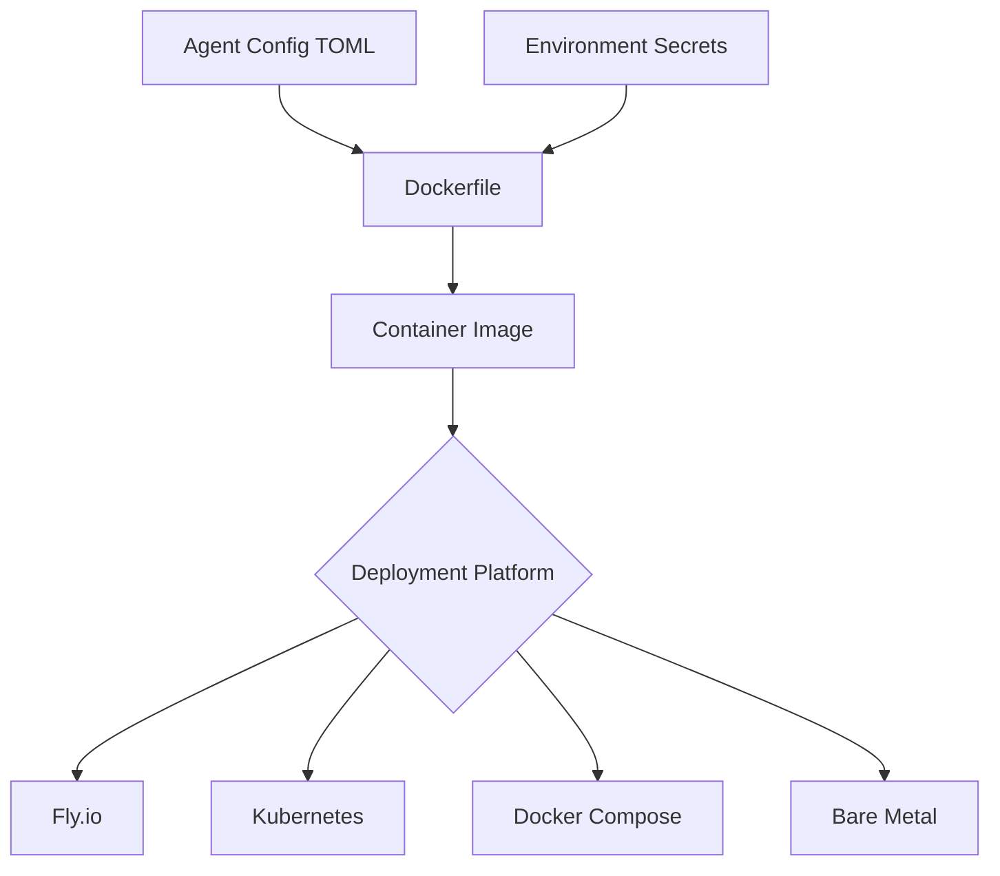

# Generic Agent Deployment System

**Goal**: Deploy any agent configuration to any platform (Fly.io, K8s, Docker, etc.) with a single command

---

## Design Principles

1. **Config-Driven**: Agent behavior defined entirely in TOML config
2. **Single Binary**: Same `agent2389` binary for all agents
3. **Environment Injection**: Secrets via environment variables
4. **Platform Agnostic**: Works on Fly.io, Kubernetes, Docker, bare metal

---

## Architecture



---

## Standard Agent Configuration Format

### Example: researcher-agent.toml

```toml
[agent]
id = "researcher-agent"
description = "Research agent with web search capabilities"
capabilities = ["research", "web_search", "summarization"]

[mqtt]
broker_url = "${MQTT_BROKER_URL}"  # Injected from environment
username_env = "MQTT_USERNAME"      # Optional
password_env = "MQTT_PASSWORD"      # Optional
heartbeat_interval_secs = 900

[llm]
provider = "openai"
model = "gpt-4o-mini"
api_key_env = "OPENAI_API_KEY"
system_prompt = """You are a research agent. Your job is to:
1. Search the web for information
2. Synthesize findings
3. Cite sources
4. Route to writer when research is complete
"""
temperature = 0.7
max_tokens = 4000

[tools]
web_search = { impl = "serper", api_key_env = "SERPER_API_KEY" }
http_request = "builtin"

[budget]
max_cost_per_task = 1.0
max_iterations = 10

[routing]
strategy = "llm"
max_iterations = 10

[routing.llm]
provider = "openai"
model = "gpt-4o-mini"
temperature = 0.1
```

---

## Generic Dockerfile

### Dockerfile.generic

```dockerfile
# Generic Agent Dockerfile
# Works with any agent configuration by mounting config at runtime

ARG RUST_VERSION=nightly
FROM rust:${RUST_VERSION}-slim-bookworm AS builder

# Install build dependencies
RUN apt-get update && apt-get install -y \
    pkg-config \
    libssl-dev \
    ca-certificates \
    && rm -rf /var/lib/apt/lists/*

WORKDIR /app

# Build dependencies layer (cached)
COPY Cargo.toml Cargo.lock ./
RUN mkdir src && \
    echo "fn main() {}" > src/main.rs && \
    CARGO_UNSTABLE_EDITION2024=1 cargo build --release && \
    rm -rf src

# Build application
COPY src ./src
RUN CARGO_UNSTABLE_EDITION2024=1 cargo build --release

# Runtime stage
FROM debian:bookworm-slim

# Install runtime dependencies
RUN apt-get update && apt-get install -y \
    ca-certificates \
    curl \
    jq \
    && rm -rf /var/lib/apt/lists/*

# Create non-root user
RUN useradd -m -u 1001 agent && \
    mkdir -p /app/config /app/logs && \
    chown -R agent:agent /app

# Copy binary
COPY --from=builder /app/target/release/agent2389 /usr/local/bin/agent2389

# Switch to non-root user
USER agent
WORKDIR /app

# Health check
HEALTHCHECK --interval=30s --timeout=10s --start-period=15s --retries=3 \
    CMD curl -f http://localhost:${HEALTH_PORT:-8080}/health || exit 1

# Environment defaults
ENV RUST_LOG=info
ENV CONFIG_PATH=/app/config/agent.toml
ENV HEALTH_PORT=8080

# IMPORTANT: Config file MUST be mounted at /app/config/agent.toml
# Secrets MUST be injected via environment variables

CMD ["sh", "-c", "agent2389 --config ${CONFIG_PATH} run"]
```

---

## Deployment Patterns

### 1. Fly.io Deployment

#### fly.toml

```toml
app = "researcher-agent"
primary_region = "sjc"

[build]
  dockerfile = "Dockerfile.generic"

[env]
  CONFIG_PATH = "/app/config/agent.toml"
  HEALTH_PORT = "8080"
  RUST_LOG = "info"
  LOG_FORMAT = "json"
  # MQTT broker URL for all agents
  MQTT_BROKER_URL = "mqtt://mqtt.yourcompany.com:1883"

[http_service]
  internal_port = 8080
  force_https = true
  auto_stop_machines = false
  auto_start_machines = true
  min_machines_running = 1

  [[http_service.checks]]
    grace_period = "30s"
    interval = "15s"
    method = "GET"
    timeout = "5s"
    path = "/health"

[[services]]
  protocol = "tcp"
  internal_port = 8080

  [[services.ports]]
    port = 80
    handlers = ["http"]

  [[services.ports]]
    port = 443
    handlers = ["tls", "http"]

  [services.concurrency]
    type = "requests"
    hard_limit = 25
    soft_limit = 20

[mounts]
  source = "agent_config"
  destination = "/app/config"
```

#### Deploy Script: deploy-to-fly.sh

```bash
#!/bin/bash
set -e

AGENT_NAME=$1
CONFIG_FILE=$2

if [ -z "$AGENT_NAME" ] || [ -z "$CONFIG_FILE" ]; then
    echo "Usage: $0 <agent-name> <config-file>"
    echo "Example: $0 researcher-agent config/agents/researcher.toml"
    exit 1
fi

# Create Fly app if it doesn't exist
if ! fly apps list | grep -q "^$AGENT_NAME"; then
    echo "Creating Fly app: $AGENT_NAME"
    fly apps create "$AGENT_NAME"
fi

# Create volume for config if it doesn't exist
if ! fly volumes list -a "$AGENT_NAME" | grep -q "agent_config"; then
    echo "Creating config volume..."
    fly volumes create agent_config --size 1 -a "$AGENT_NAME"
fi

# Upload config file to volume
echo "Uploading config: $CONFIG_FILE"
fly ssh console -a "$AGENT_NAME" -C "mkdir -p /app/config"
fly ssh sftp shell -a "$AGENT_NAME" <<EOF
put $CONFIG_FILE /app/config/agent.toml
bye
EOF

# Set secrets from environment
echo "Setting secrets..."
fly secrets set \
    OPENAI_API_KEY="$OPENAI_API_KEY" \
    SERPER_API_KEY="$SERPER_API_KEY" \
    -a "$AGENT_NAME"

# Deploy
echo "Deploying agent..."
fly deploy -a "$AGENT_NAME" --dockerfile Dockerfile.generic

echo "✅ Agent deployed: https://$AGENT_NAME.fly.dev/health"
```

**Usage**:
```bash
export OPENAI_API_KEY="sk-..."
export SERPER_API_KEY="..."

./deploy-to-fly.sh researcher-agent config/agents/researcher.toml
./deploy-to-fly.sh writer-agent config/agents/writer.toml
./deploy-to-fly.sh editor-agent config/agents/editor.toml
```

---

### 2. Kubernetes Deployment

#### Generic K8s Manifests

**ConfigMap** (agent-config.yaml):
```yaml
apiVersion: v1
kind: ConfigMap
metadata:
  name: {{ AGENT_NAME }}-config
  namespace: agents
data:
  agent.toml: |
    [agent]
    id = "{{ AGENT_NAME }}"
    # ... rest of config ...
```

**Deployment** (agent-deployment.yaml):
```yaml
apiVersion: apps/v1
kind: Deployment
metadata:
  name: {{ AGENT_NAME }}
  namespace: agents
spec:
  replicas: 1
  selector:
    matchLabels:
      app: {{ AGENT_NAME }}
  template:
    metadata:
      labels:
        app: {{ AGENT_NAME }}
    spec:
      containers:
      - name: agent
        image: agent2389:latest
        env:
        - name: CONFIG_PATH
          value: /app/config/agent.toml
        - name: HEALTH_PORT
          value: "8080"
        - name: RUST_LOG
          value: info
        - name: MQTT_BROKER_URL
          value: mqtt://mqtt-broker.agents.svc.cluster.local:1883
        - name: OPENAI_API_KEY
          valueFrom:
            secretKeyRef:
              name: llm-secrets
              key: openai-api-key
        - name: SERPER_API_KEY
          valueFrom:
            secretKeyRef:
              name: tool-secrets
              key: serper-api-key
        ports:
        - containerPort: 8080
          name: health
        volumeMounts:
        - name: config
          mountPath: /app/config
          readOnly: true
        livenessProbe:
          httpGet:
            path: /live
            port: 8080
          initialDelaySeconds: 30
          periodSeconds: 30
        readinessProbe:
          httpGet:
            path: /ready
            port: 8080
          initialDelaySeconds: 10
          periodSeconds: 10
      volumes:
      - name: config
        configMap:
          name: {{ AGENT_NAME }}-config
```

**Deploy Script** (deploy-to-k8s.sh):
```bash
#!/bin/bash
set -e

AGENT_NAME=$1
CONFIG_FILE=$2

# Create namespace if needed
kubectl create namespace agents --dry-run=client -o yaml | kubectl apply -f -

# Create ConfigMap from config file
kubectl create configmap ${AGENT_NAME}-config \
    --from-file=agent.toml=$CONFIG_FILE \
    --namespace=agents \
    --dry-run=client -o yaml | kubectl apply -f -

# Apply deployment (templated)
sed "s/{{ AGENT_NAME }}/$AGENT_NAME/g" k8s/agent-deployment.yaml | \
    kubectl apply -f -

echo "✅ Agent deployed to Kubernetes: $AGENT_NAME"
kubectl get pods -n agents -l app=$AGENT_NAME
```

---

### 3. Docker Compose Deployment

**docker-compose.yml**:
```yaml
version: '3.8'

services:
  mqtt-broker:
    image: eclipse-mosquitto:2
    ports:
      - "1883:1883"
    volumes:
      - ./scripts/mosquitto.conf:/mosquitto/config/mosquitto.conf:ro
    healthcheck:
      test: ["CMD", "mosquitto_sub", "-t", "$$SYS/#", "-C", "1"]
      interval: 10s
      timeout: 5s
      retries: 3

  # Generic agent service template
  agent:
    image: agent2389:latest
    depends_on:
      mqtt-broker:
        condition: service_healthy
    environment:
      - CONFIG_PATH=/app/config/agent.toml
      - HEALTH_PORT=8080
      - RUST_LOG=info
      - MQTT_BROKER_URL=mqtt://mqtt-broker:1883
      - OPENAI_API_KEY=${OPENAI_API_KEY}
      - SERPER_API_KEY=${SERPER_API_KEY}
    volumes:
      - ./config/agents/researcher.toml:/app/config/agent.toml:ro
    ports:
      - "8080:8080"
    healthcheck:
      test: ["CMD", "curl", "-f", "http://localhost:8080/health"]
      interval: 30s
      timeout: 10s
      retries: 3
```

**Deploy Script** (deploy-compose.sh):
```bash
#!/bin/bash

# Start with any number of agents
docker-compose up -d mqtt-broker

# Deploy researcher agent
AGENT_CONFIG=config/agents/researcher.toml docker-compose up -d researcher-agent

# Deploy writer agent
AGENT_CONFIG=config/agents/writer.toml docker-compose up -d writer-agent

# Deploy editor agent
AGENT_CONFIG=config/agents/editor.toml docker-compose up -d editor-agent
```

---

## Unified Deployment CLI

### agent-deploy Tool

```bash
#!/bin/bash
# agent-deploy: Universal agent deployment tool

set -e

COMMAND=$1
PLATFORM=$2
AGENT_NAME=$3
CONFIG_FILE=$4

usage() {
    cat <<EOF
Agent Deployment Tool - Deploy agents to any platform

Usage:
  agent-deploy deploy <platform> <agent-name> <config-file>

Platforms:
  fly       - Deploy to Fly.io
  k8s       - Deploy to Kubernetes
  docker    - Deploy to Docker Compose
  local     - Run locally

Examples:
  # Deploy to Fly.io
  agent-deploy deploy fly researcher-agent config/agents/researcher.toml

  # Deploy to Kubernetes
  agent-deploy deploy k8s writer-agent config/agents/writer.toml

  # Deploy to Docker Compose
  agent-deploy deploy docker editor-agent config/agents/editor.toml

  # Run locally
  agent-deploy deploy local test-agent config/agents/test.toml

Environment Variables Required:
  OPENAI_API_KEY      - OpenAI API key
  SERPER_API_KEY      - Serper API key (for web search)
  MQTT_BROKER_URL     - MQTT broker URL (optional for local)
EOF
    exit 1
}

deploy_fly() {
    ./scripts/deploy-to-fly.sh "$AGENT_NAME" "$CONFIG_FILE"
}

deploy_k8s() {
    ./scripts/deploy-to-k8s.sh "$AGENT_NAME" "$CONFIG_FILE"
}

deploy_docker() {
    docker-compose -f docker-compose.generic.yml \
        -e AGENT_NAME="$AGENT_NAME" \
        -e AGENT_CONFIG="$CONFIG_FILE" \
        up -d
}

deploy_local() {
    ./scripts/dev-environment.sh start
    cargo run --bin agent2389 -- --config "$CONFIG_FILE" run
}

case "$COMMAND" in
    "deploy")
        case "$PLATFORM" in
            "fly") deploy_fly ;;
            "k8s") deploy_k8s ;;
            "docker") deploy_docker ;;
            "local") deploy_local ;;
            *) usage ;;
        esac
        ;;
    *)
        usage
        ;;
esac
```

---

## Configuration Management

### Agent Config Repository Structure

```
config/
├── agents/
│   ├── researcher-agent.toml
│   ├── writer-agent.toml
│   ├── editor-agent.toml
│   ├── judge-agent.toml
│   └── specialized/
│       ├── code-reviewer.toml
│       ├── data-analyst.toml
│       └── customer-support.toml
├── environments/
│   ├── development.env
│   ├── staging.env
│   └── production.env
└── templates/
    ├── basic-agent.toml.template
    ├── routing-agent.toml.template
    └── tool-heavy-agent.toml.template
```

### Config Generator

```bash
#!/bin/bash
# generate-agent-config.sh

TEMPLATE=$1
AGENT_ID=$2
OUTPUT=$3

sed "s/{{AGENT_ID}}/$AGENT_ID/g" "config/templates/$TEMPLATE" > "$OUTPUT"

echo "✅ Generated config: $OUTPUT"
echo "Edit the config, then deploy with:"
echo "  agent-deploy deploy fly $AGENT_ID $OUTPUT"
```

---

## Best Practices

### 1. Config Validation

```bash
# Validate config before deployment
cargo run --bin agent2389 -- --config config/agents/my-agent.toml validate
```

### 2. Secrets Management

**Never commit secrets to config files!**

Use environment variable placeholders:
```toml
api_key_env = "OPENAI_API_KEY"  # ✅ Good
api_key = "sk-..."              # ❌ Bad
```

### 3. Health Checks

All deployments should use health endpoints:
- `/live` - Liveness (process alive)
- `/ready` - Readiness (can handle requests)
- `/health` - Overall health (detailed)

### 4. Logging

Production deployments should use JSON logging:
```bash
export LOG_FORMAT=json
export LOG_LEVEL=info
```

### 5. Resource Limits

Set appropriate limits in deployment configs:
```yaml
resources:
  requests:
    memory: "256Mi"
    cpu: "100m"
  limits:
    memory: "1Gi"
    cpu: "500m"
```

---

## Quick Start Examples

### Deploy to Fly.io (Zero to Production)

```bash
# 1. Install Fly CLI
curl -L https://fly.io/install.sh | sh

# 2. Login
fly auth login

# 3. Set secrets
export OPENAI_API_KEY="sk-..."
export SERPER_API_KEY="..."

# 4. Deploy
./agent-deploy deploy fly researcher-agent config/agents/researcher.toml

# 5. Check status
fly status -a researcher-agent
curl https://researcher-agent.fly.dev/health
```

### Deploy to Kubernetes (From Config)

```bash
# 1. Create agent config
./generate-agent-config.sh routing-agent.toml.template my-agent config/agents/my-agent.toml

# 2. Create secrets
kubectl create secret generic llm-secrets \
    --from-literal=openai-api-key="$OPENAI_API_KEY" \
    --namespace=agents

# 3. Deploy
./agent-deploy deploy k8s my-agent config/agents/my-agent.toml

# 4. Check status
kubectl get pods -n agents -l app=my-agent
kubectl logs -n agents -l app=my-agent --tail=50
```

---

## Troubleshooting

### Agent Won't Start

```bash
# Check config syntax
agent2389 --config /app/config/agent.toml validate

# Check environment variables
env | grep -E "OPENAI|SERPER|MQTT"

# Check logs
fly logs -a researcher-agent  # Fly.io
kubectl logs -l app=my-agent  # Kubernetes
docker logs researcher-agent  # Docker
```

### Health Checks Failing

```bash
# Test health endpoint locally
curl http://localhost:8080/health

# Check what's failing
curl -s http://localhost:8080/health | jq '.checks'

# Common issues:
# - MQTT broker unreachable
# - Missing environment variables
# - Port not exposed
```

---

## Summary

**Goal Achieved**: ✅ Deploy any agent to any platform with:
```bash
agent-deploy deploy fly my-agent config/agents/my-agent.toml
```

**Key Features**:
- Single binary, multiple configs
- Platform agnostic (Fly.io, K8s, Docker, local)
- Environment-based secrets
- Standardized health checks
- Config validation
- Zero-downtime deployments

**Next Steps**:
1. Create `scripts/deploy-to-fly.sh`
2. Create `scripts/deploy-to-k8s.sh`
3. Create `agent-deploy` CLI tool
4. Test with sample agents
