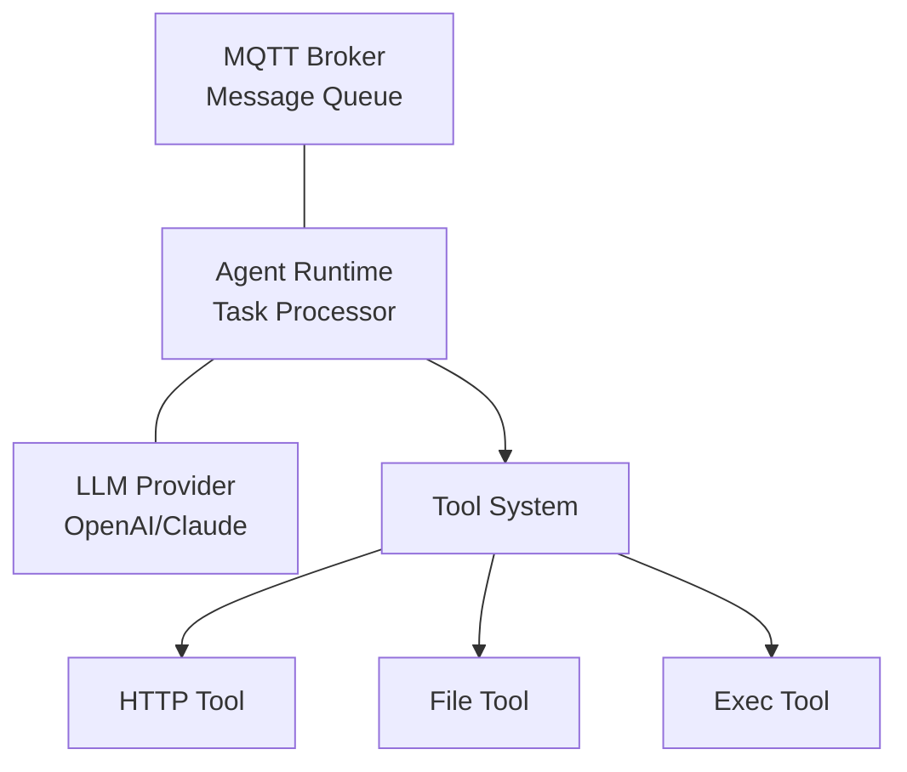

# 2389 Agent Protocol - Rust Implementation

A production-ready implementation of the 2389 Agent Protocol in Rust, enabling interoperable AI agents that
communicate via MQTT with comprehensive observability and robust error handling.

[](LICENSE)
[](https://www.rust-lang.org)
[]()

## v0.1.0 Release Notes

This is the initial release of the 2389 Agent Protocol Rust implementation.

**What's Included:**
- Complete v1.0 protocol implementation with all required message types
- Production-ready agent runtime with lifecycle management
- MQTT transport layer with QoS 1 and proper error handling
- Tool system with JSON schema validation
- Multi-LLM provider support (OpenAI, Anthropic)
- Comprehensive test suite (286 tests)
- Docker deployment support

**What's Experimental:**
- Dynamic routing (v2.0) features - 80% complete, marked as experimental
- See DYNAMIC_ROUTING_ANALYSIS.md for current implementation status

**Known Limitations:**
- Dynamic routing capability matching needs additional testing
- Hot-reload configuration not yet implemented
- Prometheus metrics export in development

## Overview

The 2389 Agent Protocol enables AI agents to work together in distributed systems using standardized MQTT
communication patterns. This Rust implementation prioritizes correctness, performance, and protocol compliance
through strong typing and comprehensive testing.

**Current Status: v0.1.0**
- ✅ Core protocol (v1.0) fully implemented and tested
- ✅ 9-step task processing algorithm complete
- ✅ MQTT transport with QoS 1 messaging
- ✅ Agent discovery system with capability matching
- 🚧 Dynamic routing (v2.0) - Experimental (see [DYNAMIC_ROUTING_ANALYSIS.md](DYNAMIC_ROUTING_ANALYSIS.md))
- ✅ 286 tests passing (213 unit + 64 integration + 9 doc)

### What This Project Provides

- **Production-Ready Agent Runtime** - Complete lifecycle management with proper startup/shutdown sequences
- **MQTT-Based Communication** - QoS 1 messaging with Last Will Testament and topic canonicalization  
- **Extensible Tool System** - JSON schema-validated tools with built-in security and sandboxing
- **Multiple LLM Support** - Pluggable providers for OpenAI, Anthropic Claude, and custom implementations
- **Comprehensive Observability** - Structured logging, metrics collection, and health monitoring
- **Container-First Design** - Docker and Kubernetes deployment with health checks and monitoring

## Key Features

### 🚀 **High Performance**

- Async-first design with Tokio runtime
- 1000+ messages/second throughput per agent
- Sub-100ms processing latency for simple tasks
- Memory-efficient with bounded resource usage

### 🔒 **Production Security**

- Environment variable credential injection
- Tool parameter validation against JSON schemas
- Process isolation for tool execution
- No sensitive data in logs or error messages

### 🛠 **Extensible Architecture**

- Trait-based tool system supporting custom implementations
- Plugin architecture for LLM providers
- Configurable pipeline depth and processing limits
- Hot-reloadable configuration (planned)

### 📊 **Complete Observability**

- Structured JSON logging with contextual spans
- Thread-safe metrics collection with percentiles
- HTTP health endpoints for orchestration platforms
- Prometheus-compatible metrics export

## Quick Start

### Prerequisites

- Rust 1.75+
- MQTT broker (e.g., Mosquitto)
- LLM provider API key (OpenAI or Anthropic)

### Installation

#### Using Cargo

```bash
cargo install agent2389
```

#### From Source

```bash
git clone https://github.com/2389-research/2389-agent-rust
cd 2389-agent-rust
cargo build --release
./target/release/agent2389 --help
```

#### Using Docker

```bash
docker pull agent2389:latest
```

### Basic Usage

1. **Start an MQTT broker:**

```bash
docker run -d --name mosquitto -p 1883:1883 eclipse-mosquitto:2
```

1. **Create agent configuration:**

```toml
# agent.toml
[agent]
id = "my-agent-001"
description = "My first 2389 agent"
capabilities = ["general-purpose", "task-execution"]

[mqtt]
broker_url = "mqtt://localhost:1883"
username_env = "MQTT_USERNAME"
password_env = "MQTT_PASSWORD"

[llm]
provider = "openai"
model = "gpt-4o"
api_key_env = "OPENAI_API_KEY"
system_prompt = "You are a helpful AI assistant."
temperature = 0.7
max_tokens = 4000

[budget]
max_tool_calls = 15
max_iterations = 8

[tools]
web_search = "builtin"
http_request = "builtin"
```

1. **Set environment variables:**

```bash
export MQTT_USERNAME=your_mqtt_user
export MQTT_PASSWORD=your_mqtt_password
export OPENAI_API_KEY=sk-your-openai-key
```

1. **Run the agent:**

```bash
agent2389 run agent.toml
```

1. **Verify it's working:**

```bash
curl http://localhost:8080/health
```

## Configuration

### Environment Variables

| Variable | Description | Required |
|----------|-------------|----------|
| `MQTT_USERNAME` | MQTT broker authentication username | Yes |
| `MQTT_PASSWORD` | MQTT broker authentication password | Yes |
| `OPENAI_API_KEY` | OpenAI API key (starts with 'sk-') | Yes* |
| `ANTHROPIC_API_KEY` | Anthropic API key (starts with 'sk-ant-') | Yes* |
| `LOG_LEVEL` | Logging level (ERROR, WARN, INFO, DEBUG) | No |
| `LOG_FORMAT` | Log format ('json' or 'pretty') | No |

*Choose one LLM provider

### Budget Configuration

The budget system prevents infinite loops and resource exhaustion by limiting the number of tool calls and iterations per task:

```toml
[budget]
max_tool_calls = 15    # Maximum tool calls per task (prevents infinite loops)
max_iterations = 8     # Maximum processing iterations (stops runaway tasks)
```

**Budget Parameters:**

- `max_tool_calls`: Total number of tool executions allowed per task. Includes HTTP requests, file operations, and custom tools. Prevents agents from making excessive API calls.
- `max_iterations`: Number of processing rounds allowed. Each iteration may include LLM calls and tool executions. Prevents infinite task loops.

**Recommended Values by Agent Type:**

```toml
# Research-focused agents (need more web requests and HTTP calls)
[budget]
max_tool_calls = 25
max_iterations = 12

# Writing agents (fewer tool calls, more thinking)
[budget]
max_tool_calls = 15
max_iterations = 8

# Editor agents (minimal tool usage)
[budget]
max_tool_calls = 10
max_iterations = 6
```

**Budget Enforcement:**

- Tool calls are counted per task execution
- Processing stops gracefully when limits are reached
- Budget exhaustion is logged and reported via MQTT
- No partial results are lost - agents provide best-effort responses

### Advanced Configuration

```toml
[agent]
id = "advanced-agent"
description = "Advanced configuration example"

[mqtt]
broker_url = "mqtts://secure-mqtt.example.com:8883"
username_env = "MQTT_USERNAME"
password_env = "MQTT_PASSWORD"
qos = 1
keep_alive = 60
ca_cert_path = "/app/certs/ca.crt"
client_cert_path = "/app/certs/client.crt"
client_key_path = "/app/certs/client.key"

[llm]
provider = "anthropic"
model = "claude-3-sonnet-20240229"
api_key_env = "ANTHROPIC_API_KEY"
system_prompt = "You are an expert software engineer."
temperature = 0.7
max_tokens = 4000

[budget]
max_tool_calls = 20
max_iterations = 10

[tools.http_request]
impl = "builtin"
config = { max_response_size = 1048576, timeout_seconds = 30 }

[tools.custom_tool]
impl = "external"
command = "/usr/local/bin/my-tool"
config = { working_dir = "/tmp", max_execution_time = 60 }

# Performance tuning
max_pipeline_depth = 16
task_timeout = 300
max_output_size = 2097152
```

## Usage Examples

### Library Usage

```rust
use agent2389::*;
use tokio;

#[tokio::main]
async fn main() -> Result<(), Box<dyn std::error::Error>> {
    // Initialize logging
    agent2389::observability::init_default_logging();
    
    // Load configuration
    let config = AgentConfig::from_file("agent.toml")?;
    
    // Create and start agent
    let mut agent = AgentRunner::new(config);
    agent.startup().await?;
    
    println!("Agent started successfully!");
    
    // Run until shutdown signal
    agent.run().await?;
    
    Ok(())
}
```

### Custom Tool Implementation

```rust
use agent2389::tools::*;
use async_trait::async_trait;
use serde_json::{json, Value};

struct CustomTool;

#[async_trait]
impl Tool for CustomTool {
    async fn describe(&self) -> ToolDescription {
        ToolDescription {
            name: "custom_operation".to_string(),
            description: "Performs custom business logic".to_string(),
            parameters: json!({
                "type": "object",
                "properties": {
                    "input": {
                        "type": "string",
                        "description": "Input data to process"
                    }
                },
                "required": ["input"]
            }),
        }
    }
    
    async fn initialize(&mut self, config: &Value) -> Result<(), ToolError> {
        // Initialize tool with configuration
        Ok(())
    }
    
    async fn execute(&self, parameters: &Value) -> Result<Value, ToolError> {
        let input = parameters["input"].as_str()
            .ok_or(ToolError::InvalidParameter("input must be string"))?;
        
        // Perform custom operation
        let result = format!("Processed: {}", input);
        
        Ok(json!({"result": result}))
    }
}
```

### Health Monitoring

```bash
# Check overall health status
curl http://localhost:8080/health | jq

# Get complete metrics
curl http://localhost:8080/metrics | jq '.tasks'

# Monitor processing in real-time
watch 'curl -s http://localhost:8080/metrics | jq "{tasks_processing: .tasks.tasks_processing, mqtt_connected: .mqtt.connected}"'
```

## Architecture

### High-Level System Design

The 2389 Agent Protocol implementation follows a modular, async-first architecture:



### Core Components

- **Agent Lifecycle Manager** - Handles startup, shutdown, and state transitions
- **MQTT Transport Layer** - QoS 1 messaging with proper topic handling
- **Task Processing Pipeline** - 9-step algorithm for protocol compliance
- **Tool Execution System** - Secure, validated tool execution
- **Observability System** - Logging, metrics, and health monitoring

### Protocol Compliance

This implementation is 100% compliant with the 2389 Agent Protocol specification:

- ✅ **Complete 9-step task processing algorithm**
- ✅ **Proper MQTT topic canonicalization**  
- ✅ **Pipeline depth enforcement (max 16)**
- ✅ **Idempotency handling with task deduplication**
- ✅ **Error publishing to conversation topics**
- ✅ **Last Will Testament for availability status**

## Docker Deployment

### Quick Start with Docker

```bash
# Run with environment variables
docker run -d \
  --name agent2389 \
  --restart unless-stopped \
  -p 8080:8080 \
  -e AGENT_ID=prod-agent-001 \
  -e MQTT_HOST=mqtt.example.com \
  -e OPENAI_API_KEY=sk-your-key \
  -v $(pwd)/config:/app/config:ro \
  agent2389:latest
```

### Docker Compose

```yaml
version: '3.8'

services:
  agent2389:
    image: agent2389:latest
    restart: unless-stopped
    ports:
      - "8080:8080"
    environment:
      - AGENT_ID=prod-agent-001
      - MQTT_HOST=mqtt-broker
      - OPENAI_API_KEY=${OPENAI_API_KEY}
      - LOG_FORMAT=json
      - LOG_LEVEL=INFO
    volumes:
      - ./config/agent.toml:/app/config/agent.toml:ro
    healthcheck:
      test: ["CMD", "curl", "-f", "http://localhost:8080/health"]
      interval: 30s
      timeout: 10s
      retries: 3
    depends_on:
      - mqtt-broker
      
  mqtt-broker:
    image: eclipse-mosquitto:2
    ports:
      - "1883:1883"
    volumes:
      - ./mosquitto.conf:/mosquitto/config/mosquitto.conf
```

## Development

### Building from Source

```bash
# Clone repository
git clone https://github.com/2389-research/2389-agent-rust
cd 2389-agent-rust

# Install development tools
cargo install cargo-watch cargo-nextest cargo-tarpaulin

# Run development loop
cargo watch -x fmt -x "clippy --fix --allow-dirty" -x test
```

### Development Commands

```bash
# Format code
cargo fmt

# Lint and fix issues  
cargo clippy --fix --allow-dirty

# Run tests
cargo test

# Run tests with coverage
cargo tarpaulin --fail-under 80

# Generate documentation
cargo doc --no-deps --open

# Run with debug logging
LOG_LEVEL=DEBUG LOG_FORMAT=pretty cargo run -- run agent.toml
```

### Testing

The project uses comprehensive testing strategies:

- **Unit Tests** - Test individual components and functions
- **Property-Based Tests** - Use `proptest` for edge case discovery
- **Integration Tests** - Test with real MQTT broker using `testcontainers`
- **Protocol Compliance Tests** - Verify adherence to specification requirements

```bash
# Run all tests
cargo test

# Run specific test module
cargo test protocol::messages::tests

# Run integration tests with real MQTT
cargo test --test integration_test

# Run property-based tests
cargo test --test property_tests
```

### Quality Gates

Before submitting contributions, ensure all quality gates pass:

```bash
# Pre-commit quality check
./scripts/quality-check.sh

# Or run manually:
cargo fmt --check
cargo clippy --all-targets -- -D warnings
cargo test --lib
cargo test --test integration_test
```

### Development Tools

This project includes several Rust-based development tools:

#### MQTT Monitor (`mqtt-monitor`)

Monitor MQTT topics with real-time display and filtering:

```bash
# Monitor default agent
cargo run --bin mqtt-monitor

# Monitor specific agent with filtering
cargo run --bin mqtt-monitor -- --agent-id researcher-agent

# Connect to remote broker
cargo run --bin mqtt-monitor -- \
  --broker-url mqtt://mqtt.example.com:1883 \
  --username myuser \
  --password mypass
```

#### Dynamic Message Injector (`dynamic-injector`)

Create and send TaskEnvelope v2.0 messages with dynamic routing:

```bash
# Send task with smart agent discovery
cargo run --bin dynamic-injector -- \
  --query "Research AI developments" \
  --discovery-timeout 5

# Preview routing decision without sending
cargo run --bin dynamic-injector -- \
  --query "Process urgent customer request" \
  --preview-only

# Send to specific agent
cargo run --bin dynamic-injector -- \
  --query "Test message" \
  --target-agent my-agent-001
```

#### Pipeline Injector (`pipeline-injector`)

Send multi-agent pipeline tasks:

```bash
# Send research → write → edit pipeline
cargo run --bin pipeline-injector -- \
  --topic "Rust async programming best practices"

# Custom pipeline
cargo run --bin pipeline-injector -- \
  --topic "Custom topic" \
  --first-agent researcher-agent
```

#### Message Injector (`inject-message`)

Simple message injection for testing:

```bash
# Send basic task
cargo run --bin inject-message -- \
  --agent-id test-agent \
  --message "Test task content"
```

#### Tool Benefits

- **Type Safety**: No more string manipulation errors from shell scripts
- **Cross-Platform**: Works on Windows, macOS, and Linux
- **Protocol Compliant**: Generates valid TaskEnvelope messages
- **Async Operations**: Concurrent operations with Tokio
- **Self-Documenting**: Built-in `--help` for all commands

## Documentation

### Complete Documentation Set

#### Core Implementation
- **[Technical Requirements](docs/TECHNICAL_REQUIREMENTS.md)** - Complete implementation specification
- **[System Architecture](docs/ARCHITECTURE.md)** - Design decisions and component interactions
- **[TaskEnvelope Protocol](docs/TASKENVELOPE_PROTOCOL.md)** - Protocol v1.0 and v2.0 specification
- **[Agent Capabilities](docs/AGENT_CAPABILITIES.md)** - Agent discovery and capability system

#### V2 Routing System
- **[V2 Routing Architecture](docs/v2_routing_architecture.md)** - Router-based workflow decisions
- **[Agent System Prompt Guidelines](docs/agent_system_prompts.md)** - Writing routing-agnostic agents
- **[Dynamic Routing Analysis](DYNAMIC_ROUTING_ANALYSIS.md)** - Current state of v2.0 routing implementation

#### Operations & Testing
- **[Testing Guide](TESTING.md)** - Comprehensive testing procedures
- **[Test Coverage](TEST_COVERAGE_SUMMARY.md)** - Current test coverage metrics
- **[Deployment Guide](docs/DEPLOYMENT.md)** - Production deployment patterns
- **[Observability Guide](docs/OBSERVABILITY.md)** - Logging, metrics, and monitoring
- **[Task Injector Guide](docs/TASK_INJECTOR_GUIDE.md)** - Using message injection tools

### API Documentation

Generate and view the complete API documentation:

```bash
cargo doc --no-deps --open
```

The documentation includes:

- Complete API reference with examples
- Protocol message format specifications  
- Configuration options and validation rules
- Error types and handling patterns
- Performance characteristics and benchmarks

## Monitoring & Observability

### Health Endpoints

- **`/health`** - Comprehensive health with component checks
- **`/ready`** - Kubernetes readiness probe (MQTT connectivity)
- **`/live`** - Kubernetes liveness probe (basic responsiveness)
- **`/metrics`** - Complete metrics in JSON format

### Key Metrics

```json
{
  "tasks": {
    "tasks_completed": 1250,
    "tasks_processing": 3,
    "avg_processing_time_ms": 847.2,
    "processing_time_p95_ms": 2100.0
  },
  "mqtt": {
    "connected": true,
    "messages_published": 2450,
    "connection_failures": 1
  },
  "tools": {
    "total_executions": 890,
    "avg_execution_time_ms": 425.1
  }
}
```

### Structured Logging

Production logging uses structured JSON format:

```json
{
  "timestamp": "2024-01-01T12:00:00Z",
  "level": "INFO", 
  "target": "agent2389::agent::processor",
  "span": {
    "name": "task_processing",
    "task_id": "550e8400-e29b-41d4-a716-446655440000",
    "agent_id": "prod-agent-001"
  },
  "fields": {
    "message": "Task completed successfully",
    "duration_ms": 1247
  }
}
```

## Performance

### Benchmarks

**Task Processing:**

- Simple tasks: ~10ms average latency
- Complex LLM tasks: 500ms-5s (depends on provider)
- Throughput: 1000+ messages/second per agent

**Resource Usage:**

- Baseline memory: ~50MB
- Per-task memory: ~1-10MB
- CPU: Low baseline, spikes during LLM calls

### Scalability

- **Horizontal**: Deploy multiple agents with unique IDs
- **Vertical**: Single agent handles high message volume
- **Resource Limits**: Configurable memory and processing bounds

## Security

### Security Features

- **Credential Management** - Environment variable injection, no secrets in config
- **Input Validation** - JSON schema validation for all tool parameters  
- **Process Isolation** - Tools execute in separate processes with timeouts
- **Output Sanitization** - No sensitive data in logs or error messages
- **TLS Support** - MQTT over TLS with client certificate authentication

### Production Security Checklist

- [ ] Use TLS for MQTT connections (port 8883)
- [ ] Store API keys in proper secret management systems
- [ ] Enable client certificate authentication
- [ ] Configure network policies and firewall rules
- [ ] Regular security audits with `cargo audit`
- [ ] Container scanning for vulnerabilities

## Troubleshooting

### Common Issues

1. **MQTT Connection Failed**

   ```bash
   # Test connectivity
   telnet mqtt-broker 1883
   # Verify credentials
   mosquitto_pub -h mqtt-broker -t test -m hello -u username -P password
   ```

2. **High Memory Usage**

   ```bash
   # Check pipeline depth
   curl http://localhost:8080/metrics | jq '.tasks.current_pipeline_depth'
   ```

3. **LLM API Errors**

   ```bash
   # Test API key validity
   curl -H "Authorization: Bearer $OPENAI_API_KEY" https://api.openai.com/v1/models
   ```

### Debug Mode

```bash
# Enable detailed logging
LOG_LEVEL=DEBUG LOG_SPANS=true ./agent2389 run

# Monitor in real-time
tail -f logs/agent.log | jq 'select(.level=="ERROR")'
```

### Getting Help

- Check the [troubleshooting guide](docs/DEPLOYMENT.md#troubleshooting)
- Review logs with `LOG_LEVEL=DEBUG`
- Use health endpoints to diagnose issues
- Consult the [API documentation](https://docs.rs/agent2389)

## Contributing

We welcome contributions! Please see our [contributing guidelines](CONTRIBUTING.md) for details.

### Development Workflow

1. Fork the repository
2. Create a feature branch
3. Write tests for new functionality
4. Ensure all quality gates pass
5. Submit a pull request

### Code Quality Standards

- All code must pass `cargo clippy` with no warnings
- Test coverage must be ≥80%
- Documentation required for all public APIs
- Follow existing code style and patterns

## License

This project is licensed under either of

- Apache License, Version 2.0, ([LICENSE-APACHE](LICENSE-APACHE) or <http://www.apache.org/licenses/LICENSE-2.0>)
- MIT license ([LICENSE-MIT](LICENSE-MIT) or <http://opensource.org/licenses/MIT>)

at your option.

## Support

- 📚 **Documentation**: Complete guides in the [docs/](docs/) directory
- 🐛 **Bug Reports**: [GitHub Issues](https://github.com/2389-research/2389-agent-rust/issues)
- 💬 **Discussions**: [GitHub Discussions](https://github.com/2389-research/2389-agent-rust/discussions)
- 📧 **Security Issues**: <security@example.com>

---

**Built with ❤️ in Rust** | **Production-ready** | **Protocol Compliant** | **Fully Observable**
