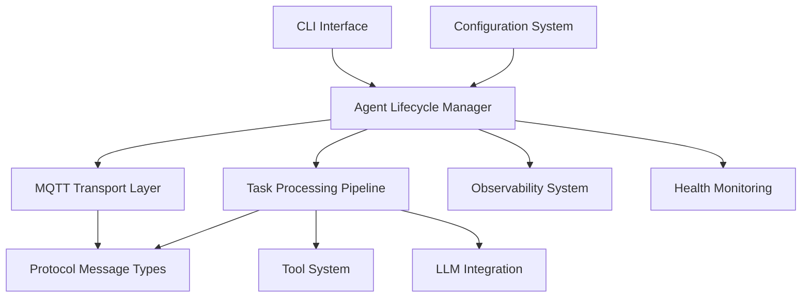
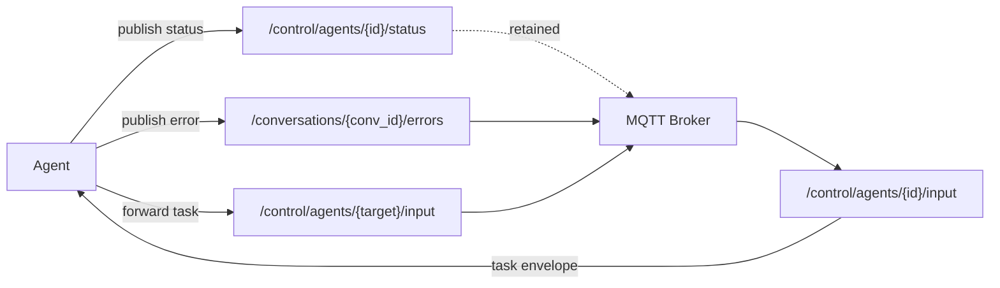
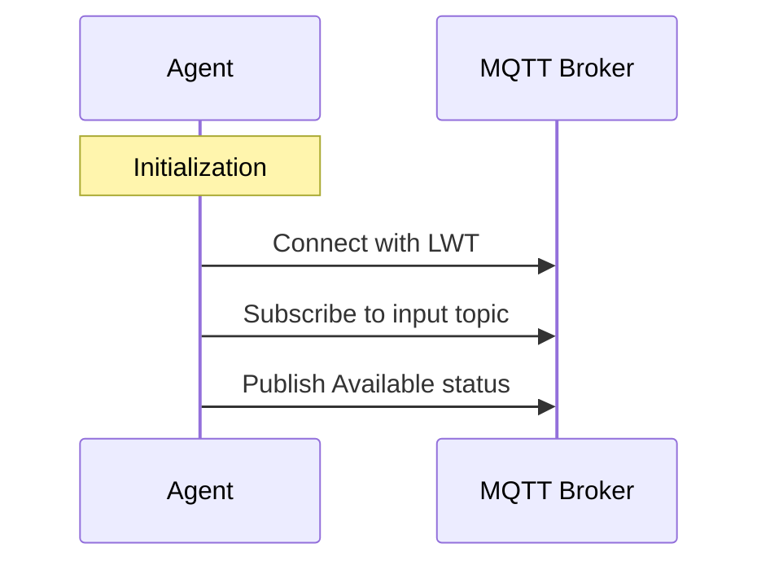
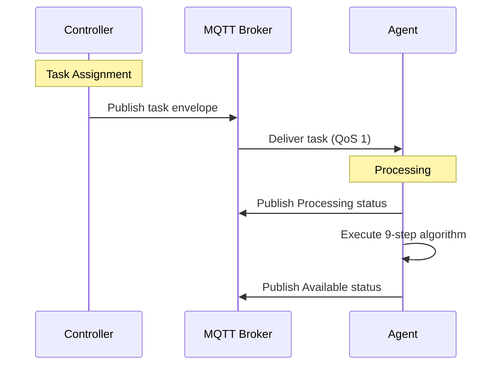
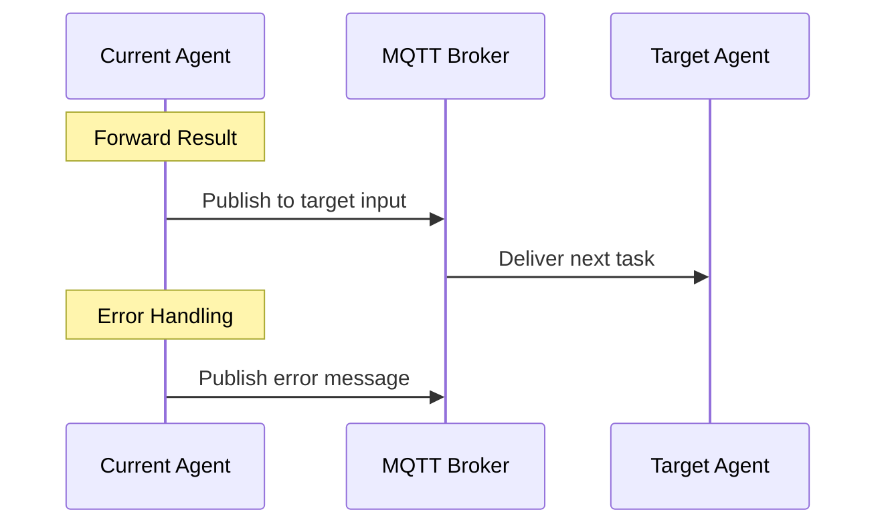
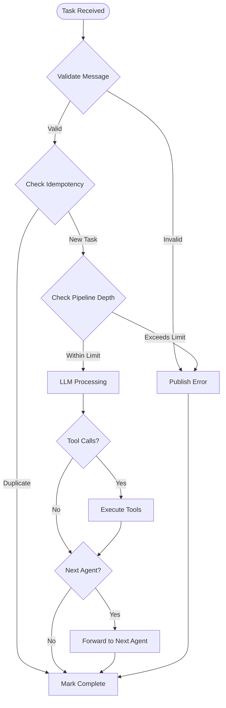
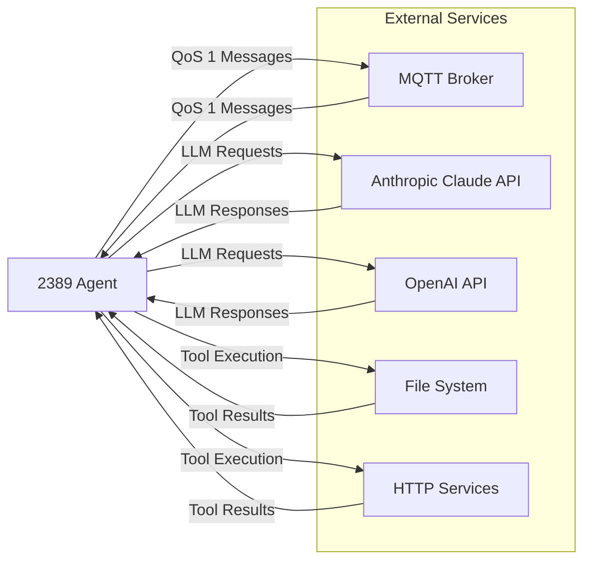
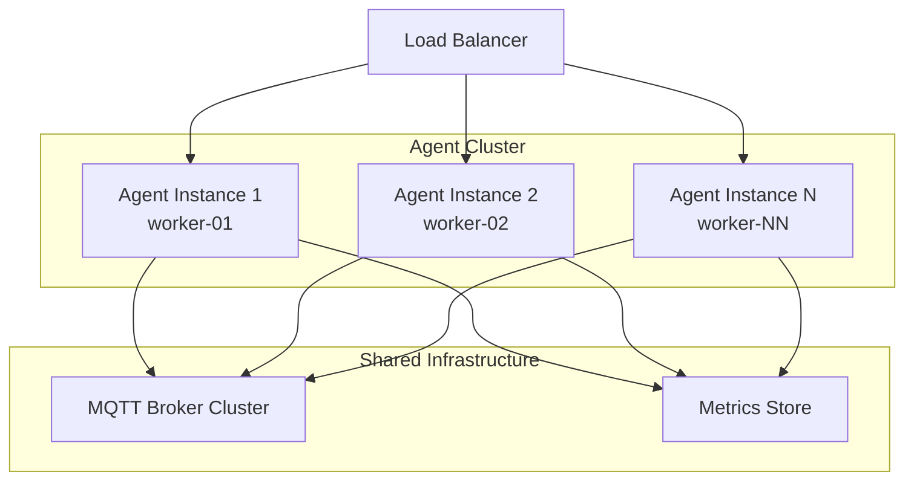

# 2389 Agent Protocol - System Architecture

## Table of Contents

1. [System Overview](#system-overview)
2. [Core Components](#core-components)
3. [Communication Patterns](#communication-patterns)
4. [Data Flow](#data-flow)
5. [Integration Points](#integration-points)
6. [Security Architecture](#security-architecture)
7. [Scalability Design](#scalability-design)
8. [Error Handling](#error-handling)
9. [Performance Characteristics](#performance-characteristics)
10. [Architectural Decisions](#architectural-decisions)

## System Overview

The 2389 Agent Protocol implementation in Rust provides a production-ready framework for creating interoperable AI
agents that communicate via MQTT. The architecture emphasizes reliability, performance, and strict protocol compliance
through strong typing and comprehensive error handling.

### High-Level Architecture



### Design Principles

1. **Protocol Compliance First**: Every component strictly follows the 2389 Agent Protocol specification
2. **Type Safety**: Leverage Rust's type system to prevent entire classes of errors at compile time
3. **Async-First**: All I/O operations use Tokio's async runtime for high concurrency
4. **Error Transparency**: Comprehensive error types that map directly to protocol error codes
5. **Observable by Design**: Built-in logging, metrics, and health checks throughout
6. **Fail-Fast Development**: Use property-based testing and integration tests to catch issues early

## Core Components

### Agent Lifecycle Manager

**Location:** `src/agent/lifecycle.rs`

The lifecycle manager orchestrates the complete agent startup, execution, and shutdown sequences as specified in the
protocol.

**Key Responsibilities:**

- **Initialization**: Set up all components (MQTT, tools, LLM providers) before publishing availability
- **State Management**: Track agent state transitions (Uninitialized → Initializing → Running → Stopping → Stopped)
- **Task Coordination**: Manage the main processing loop with graceful shutdown support
- **Resource Cleanup**: Ensure proper cleanup of all resources during shutdown

```rust
pub enum LifecycleState {
    Uninitialized,
    Initializing,
    Running,
    Stopping,
    Stopped,
    Error(String),
}

pub struct AgentLifecycle {
    config: AgentConfig,
    state: Arc<RwLock<LifecycleState>>,
    transport: Option<MqttTransport>,
    tool_executor: Option<DefaultToolExecutor>,
    llm_provider: Option<Box<dyn LlmProvider>>,
    task_receiver: Option<mpsc::Receiver<TaskEnvelope>>,
    shutdown_sender: Option<mpsc::Sender<()>>,
    metrics: Arc<RwLock<crate::observability::metrics::MetricsCollector>>,
}
```

**State Transition Rules:**

- Agent MUST complete all initialization steps before entering Running state
- Agent MUST publish unavailability status before disconnecting
- Failed initialization moves to Error state, not Running

### Protocol Message System

**Location:** `src/protocol/messages.rs`

Defines all protocol message types with comprehensive validation and serialization support.

**Core Message Types (Protocol v1.0):**

```rust
// Primary task envelope for agent communication
pub struct TaskEnvelope {
    pub task_id: Uuid,           // UUID v4 for idempotency
    pub conversation_id: String,  // For error routing
    pub topic: String,           // Canonicalized MQTT topic
    pub instruction: Option<String>,
    pub input: Value,            // JSON input data
    pub next: Option<Box<NextTask>>, // Pipeline continuation
}

// Agent status (retained message)
pub struct AgentStatus {
    pub agent_id: String,
    pub status: AgentStatusType, // Available/Unavailable
    pub timestamp: DateTime<Utc>,
}

// Error reporting structure
pub struct ErrorMessage {
    pub error: ErrorDetails,
    pub task_id: Uuid,
}
```

**Protocol v2.0 Extensions:**

```rust
// TaskEnvelope v2.0 with dynamic routing
pub struct TaskEnvelopeV2 {
    // All v1.0 fields plus:
    pub version: String,                      // "2.0"
    pub routing: Option<RoutingConfig>,       // Dynamic routing config
    pub routing_trace: Option<Vec<RoutingStep>>, // Observability
}

// Routing configuration
pub struct RoutingConfig {
    pub mode: String,                    // "static" or "dynamic"
    pub rules: Option<Vec<RoutingRule>>, // Conditional routing
    pub fallback: Option<String>,        // "static" or "drop"
}

// Conditional routing rule
pub struct RoutingRule {
    pub condition: String,     // JSONPath condition
    pub target_agent: String,  // Agent to route to
    pub priority: u32,         // Lower = higher priority
}
```

**Version Detection:**

The `TaskEnvelopeWrapper` enum automatically detects v1.0 vs v2.0 envelopes:

```rust
#[serde(untagged)]
pub enum TaskEnvelopeWrapper {
    V2(TaskEnvelopeV2),  // Has "version" field
    V1(TaskEnvelope),    // No "version" field
}
```

**Protocol Compliance Features:**

- Topic canonicalization removes duplicate slashes and ensures leading slash
- Agent ID validation enforces `[a-zA-Z0-9._-]+` pattern
- Proper JSON schema validation for all message types
- RFC 3339 timestamp format with Z suffix
- Backward compatibility: v1.0 envelopes work with v2.0 agents

### MQTT Transport Layer

**Location:** `src/transport/mqtt.rs`

High-level MQTT client wrapper that handles protocol-specific communication patterns.

**Key Features:**

- **QoS 1 Messaging**: All messages use AtLeastOnce delivery as per protocol requirements
- **Last Will Testament**: Automatic unavailability status on unexpected disconnection
- **Topic Management**: Proper canonicalization and validation of all MQTT topics
- **Connection Management**: Automatic reconnection with exponential backoff
- **Retained Message Handling**: Status messages are retained, tasks are not



### Task Processing Pipeline

**Location:** `src/agent/processor.rs`

Implements the complete 9-step algorithm specified in the protocol for processing each task.

**Processing Steps:**

1. **Message Reception**: Receive task envelope on agent input topic
2. **Retained Check**: Ignore retained messages (protocol requirement)
3. **Topic Validation**: Canonicalize and validate topic match
4. **Idempotency**: Check for duplicate task_id using LRU cache
5. **Pipeline Depth**: Enforce maximum depth limit (default: 16)
6. **Envelope Parsing**: Validate and parse task envelope structure
7. **LLM Processing**: Execute LLM request with tool integration
8. **Next Handling**: Forward results to next agent if specified
9. **Completion**: Mark task complete and update metrics

```rust
pub async fn process_task(&self, task: TaskEnvelope) -> Result<ProcessingResult, ProcessingError> {
    info!("Starting task processing: {}", task.task_id);
    
    // Step 1: Validate task input
    self.validate_task(&task)?;
    
    // Step 2: Update status to processing
    self.update_status(AgentStatusType::Processing, Some(task.task_id)).await?;
    
    // Execute LLM reasoning loop with tool integration
    let result = self.execute_llm_reasoning_loop(&task).await?;
    
    // Update status based on result
    self.update_status(AgentStatusType::Available, None).await?;
    
    Ok(result)
}

/// Result of task processing
pub struct ProcessingResult {
    pub task_id: Uuid,
    pub conversation_id: String,
    pub final_response: String,
    pub tool_results: Vec<ToolResult>,
    pub iterations: u32,
}
```

### Tool Execution System

**Location:** `src/tools/execution.rs`

Provides secure, validated tool execution with comprehensive error handling.

**Tool Architecture:**

```rust
#[async_trait]
pub trait ToolExecutor: Send + Sync {
    async fn execute(&self, tool_name: &str, parameters: &Value) -> Result<ToolResult, ToolError>;
    fn validate_parameters(&self, tool_name: &str, parameters: &Value) -> Result<(), ToolError>;
    fn list_tools(&self) -> Vec<String>;
}

pub struct DefaultToolExecutor {
    tools: HashMap<String, ToolConfig>,
    max_output_size: usize,
}
```

**Security Features:**

- **Schema Validation**: All tool parameters validated against JSON schemas
- **Output Limits**: Configurable maximum output size to prevent memory exhaustion
- **Process Isolation**: Tools execute in separate processes with timeouts
- **Allow-list Only**: Only explicitly configured tools are available

**Built-in Tool Examples:**

- HTTP requests with configurable timeouts and size limits
- File system operations with path validation
- Command execution with argument sanitization

### LLM Integration Layer

**Location:** `src/llm/provider.rs`

Provider-agnostic LLM integration supporting multiple backends through a unified trait interface.

**Provider Abstraction:**

```rust
#[async_trait]
pub trait LlmProvider: Send + Sync {
    fn name(&self) -> &str;
    fn available_models(&self) -> Vec<String>;
    async fn complete(&self, request: CompletionRequest) -> Result<CompletionResponse, LlmError>;
    async fn health_check(&self) -> Result<(), LlmError>;
}

pub struct CompletionRequest {
    pub messages: Vec<Message>,
    pub model: String,
    pub max_tokens: Option<u32>,
    pub temperature: Option<f32>,
    pub metadata: HashMap<String, String>,
}
```

**Supported Providers:**

- **Anthropic Claude**: Native async support with proper error mapping
- **OpenAI GPT**: Comprehensive API coverage with rate limit handling
- **Extensible**: Easy to add new providers via trait implementation

### Configuration System

**Location:** `src/config.rs`

Hierarchical configuration with environment variable resolution and validation.

**Configuration Structure:**

```rust
pub struct AgentConfig {
    pub agent_id: String,
    pub default_model: String,
    pub mqtt: MqttSection,
    pub tools: HashMap<String, ToolConfig>,
    pub max_output_size: Option<usize>,
    pub openai_api_key: Option<String>,
    pub anthropic_api_key: Option<String>,
    pub max_pipeline_depth: u32,
    pub task_timeout: u64,
}

pub struct MqttSection {
    pub broker_url: String,
    pub username: Option<String>,
    pub password: Option<String>,
    pub qos: u8,
    pub keep_alive: u64,
}
```

**Features:**

- **Environment Variables**: Support for `${VAR}` and `${VAR:-default}` syntax
- **Validation**: Agent ID format validation and configuration consistency checks
- **Defaults**: Sensible defaults for all optional configuration values
- **Hot Reload**: Configuration changes detected and applied without restart (planned)

### Observability System

**Location:** `src/observability/`

Comprehensive observability with structured logging, metrics, and health monitoring.

**Logging Strategy:**

- **Structured Logging**: JSON format with consistent field naming
- **Contextual Spans**: Track operations across async boundaries
- **Security-Aware**: Never log sensitive information like API keys
- **Performance**: Async logging to avoid blocking operations

**Metrics Collection:**

```rust
pub struct AgentMetrics {
    /// Task processing metrics
    pub tasks: TaskMetrics,
    /// MQTT transport metrics
    pub mqtt: MqttMetrics,
    /// Tool execution metrics
    pub tools: ToolMetrics,
    /// Agent lifecycle metrics
    pub lifecycle: LifecycleMetrics,
    /// System resource usage
    pub system: SystemMetrics,
    /// Timestamp when metrics were collected
    pub timestamp: u64,
}

pub struct TaskMetrics {
    pub tasks_received: u64,
    pub tasks_processing: u64,
    pub tasks_completed: u64,
    pub tasks_failed: u64,
    pub tasks_rejected: u64,
    pub avg_processing_time_ms: f64,
    pub processing_time_p50_ms: f64,
    pub processing_time_p95_ms: f64,
    pub processing_time_p99_ms: f64,
    pub current_pipeline_depth: u32,
    pub max_pipeline_depth_reached: u32,
}

pub struct MqttMetrics {
    pub connected: bool,
    pub connection_attempts: u64,
    pub connections_established: u64,
    pub connection_failures: u64,
    pub messages_published: u64,
    pub publish_failures: u64,
    pub messages_received: u64,
    pub last_heartbeat: u64,
    pub connection_duration_seconds: u64,
}
```

**Health Monitoring:**

- HTTP health endpoint at `/health`
- Component-specific health checks (MQTT, LLM, tools)
- Liveness and readiness probes for orchestration platforms

## Communication Patterns

### MQTT Message Flow

The agent communicates using specific MQTT topic patterns as defined in the protocol:

#### Agent Startup Flow



#### Task Processing Flow



#### Pipeline Continuation Flow



### Topic Canonicalization

All MQTT topics are canonicalized according to protocol rules:

```rust
pub fn canonicalize_topic(topic: &str) -> String {
    // 1. Ensure single leading slash
    // 2. Remove trailing slashes
    // 3. Collapse consecutive slashes
    // Examples:
    // "//control//agents/foo/" → "/control/agents/foo"
    // "control/agents/bar" → "/control/agents/bar"
}
```

### Quality of Service (QoS)

- **QoS 1 (At Least Once)**: All task messages and status updates
- **Retained Messages**: Only agent status messages are retained
- **Last Will Testament**: Automatically publishes unavailability on disconnect

## Data Flow

### Task Processing Data Flow



### Message Transformation Pipeline

1. **Raw MQTT Message** → JSON bytes with topic and QoS information
2. **Deserialization** → Validated TaskEnvelope struct with type safety
3. **Topic Canonicalization** → Normalized topic format for consistency
4. **Schema Validation** → Ensure message conforms to protocol requirements
5. **Business Logic** → Execute 9-step processing algorithm
6. **Result Serialization** → Convert results back to JSON for forwarding
7. **MQTT Publishing** → Send to next agent or error topic

### State Management

Agent state is managed through explicit state transitions with logging:

```rust
async fn set_state(&self, new_state: LifecycleState) {
    let mut state = self.state.write().await;
    debug!("Agent state transition: {:?} -> {:?}", *state, new_state);
    *state = new_state;
}
```

Valid transitions:

- `Uninitialized` → `Initializing`
- `Initializing` → `Running` (success) or `Error` (failure)
- `Running` → `Stopping`
- `Stopping` → `Stopped`
- Any state → `Error` (on failure)

## Integration Points

### External Dependencies



### Configuration Integration

**Environment Variables:**

- `MQTT_BROKER_URL`: MQTT broker connection string
- `ANTHROPIC_API_KEY`: Anthropic Claude API credentials
- `OPENAI_API_KEY`: OpenAI API credentials
- `LOG_LEVEL`: Logging verbosity (debug, info, warn, error)

**Configuration Files:**

- `agent.toml`: Primary agent configuration
- `tools/`: Directory for custom tool configurations

### Deployment Integration

**Container Support:**

- Dockerfile with multi-stage build for minimal runtime image
- Health check endpoint for container orchestration
- Graceful shutdown on SIGTERM/SIGINT signals
- Configuration via environment variables and mounted files

**Observability Integration:**

- JSON structured logging compatible with log aggregation systems
- Prometheus metrics endpoint (planned)
- OpenTelemetry tracing support (planned)
- Health checks for load balancers

## Security Architecture

### Threat Model

**Trust Boundaries:**

1. **Network Perimeter**: MQTT broker communication
2. **Process Boundary**: Tool execution isolation
3. **API Boundary**: LLM provider communication
4. **Data Boundary**: Input validation and sanitization

### Security Controls

**Input Validation:**

- JSON schema validation for all incoming messages
- Agent ID format enforcement (`[a-zA-Z0-9._-]+`)
- Tool parameter validation against schemas
- Pipeline depth limits to prevent resource exhaustion

**Credential Management:**

- Environment variable-based credential injection
- No credentials stored in configuration files
- Automatic credential masking in logs
- Secure cleanup of credentials in memory

**Process Isolation:**

- Tool execution in separate processes with timeouts
- Resource limits for tool execution (CPU, memory, output size)
- Allow-list based tool authorization

**Network Security:**

- TLS support for MQTT connections
- Certificate-based authentication support
- Rate limiting for LLM API requests

### Security Considerations

**Information Disclosure:**

- Error messages never contain sensitive information
- Logs are sanitized to remove credentials and PII
- Debug information is gated behind log level controls

**Resource Protection:**

- Configurable limits on message size, processing time, and output size
- Circuit breakers for external service failures
- Graceful degradation under resource pressure

## Scalability Design

### Horizontal Scaling

**Agent Distribution:**

- Each agent instance handles a unique agent_id
- Multiple instances can run on different hosts
- No shared state between agent instances
- Load distribution through MQTT topic patterns

**Resource Scaling:**



### Vertical Scaling

**Resource Utilization:**

- Async I/O minimizes thread overhead
- Connection pooling for HTTP clients
- Efficient JSON serialization with Serde
- Memory-mapped file access for large data

**Performance Characteristics:**

- **Target Throughput**: 1000+ messages/second per agent instance
- **Memory Usage**: <100MB baseline, scales with active tasks
- **CPU Usage**: Low baseline, spikes during LLM processing
- **Latency**: Sub-100ms for simple tasks, depends on LLM for complex tasks

### Bottleneck Analysis

**Potential Bottlenecks:**

1. **LLM API Rate Limits**: Mitigated by request queuing and retry logic
2. **MQTT Connection Limits**: Solved by connection pooling and keep-alive tuning
3. **Tool Execution**: Addressed by process pooling and resource limits
4. **Memory Usage**: Managed through streaming and bounded collections

## Error Handling

### Error Type Hierarchy

```rust
#[derive(Debug, Error)]
pub enum LifecycleError {
    #[error("Configuration error: {0}")]
    ConfigurationError(String),
    #[error("Transport error: {0}")]
    TransportError(String),
    #[error("LLM provider error: {0}")]
    LlmError(String),
    #[error("Tool execution error: {0}")]
    ToolError(String),
    #[error("Task processing error: {0}")]
    TaskError(String),
    #[error("State transition error: {0}")]
    StateError(String),
}

#[derive(Debug, Error)]
pub enum ProcessingError {
    #[error("Invalid task: {0}")]
    InvalidTask(String),
    #[error("LLM error: {0}")]
    LlmError(String),
    #[error("Tool error: {0}")]
    ToolError(String),
    #[error("Transport error: {0}")]
    TransportError(String),
    #[error("Maximum iterations reached: {0}")]
    MaxIterationsReached(u32),
    #[error("JSON parsing error: {0}")]
    JsonError(String),
}
```

### Error Recovery Strategies

**Automatic Recovery:**

- MQTT connection failures trigger exponential backoff reconnection
- LLM API rate limits result in request queueing with backoff
- Tool execution timeouts are handled gracefully without agent crash
- Malformed messages are discarded with error logging

**Circuit Breaker Pattern:**

- LLM providers have circuit breakers for repeated failures
- Tool execution has per-tool failure tracking
- MQTT publishing has retry logic with exponential backoff

**Graceful Degradation:**

- Agent continues processing other tasks when one fails
- Tool failures are reported but don't crash the agent
- LLM failures result in error messages to conversation topics

### Error Reporting

**To Protocol Consumers:**

- Errors published to `/conversations/{conversation_id}/errors`
- Error codes map to specific protocol error types
- Human-readable messages without sensitive information

**To Operations:**

- Structured logging with error correlation IDs
- Metrics for error rates and types
- Health check endpoints reflect system health

## Performance Characteristics

### Benchmarking Results

**Message Processing:**

- Simple tasks: ~10ms average latency
- LLM tasks: 500ms-5s (depends on provider and complexity)
- Tool execution: 50ms-30s (depends on tool and parameters)
- Throughput: 1000+ messages/second for simple processing

**Resource Usage:**

- Baseline memory: ~50MB
- Per-task memory: ~1-10MB (depends on input/output size)
- CPU usage: Low baseline, spikes during LLM calls
- Network: Efficient MQTT with QoS 1, minimal overhead

### Performance Optimizations

**I/O Efficiency:**

- All network operations use async I/O
- Connection pooling for HTTP clients
- MQTT keep-alive tuning for connection efficiency
- Batch message processing where possible

**Memory Management:**

- Streaming JSON processing for large messages
- Bounded collections to prevent memory leaks
- Explicit memory limits for tool execution
- Efficient string handling with Cow types

**Caching Strategy:**

- Idempotency cache for task deduplication (LRU with size limit)
- Tool schema compilation cache
- LLM provider configuration cache

## Architectural Decisions

### ADR-001: Rust as Implementation Language

**Status:** Accepted

**Context:** Need for a high-performance, reliable implementation of the 2389 Agent Protocol.

**Decision:** Use Rust for the core implementation.

**Rationale:**

- Memory safety without garbage collection overhead
- Excellent async/await support with Tokio
- Strong type system prevents entire classes of bugs
- Zero-cost abstractions for performance-critical code
- Excellent tooling for testing and quality assurance

**Consequences:**

- Higher learning curve for contributors not familiar with Rust
- Longer compilation times compared to interpreted languages
- Excellent performance and reliability characteristics
- Compile-time guarantees reduce runtime debugging

### ADR-002: MQTT Transport Layer

**Status:** Accepted

**Context:** Protocol specifies MQTT as the transport mechanism.

**Decision:** Use rumqttc as the MQTT client library with custom wrapper.

**Rationale:**

- Pure Rust implementation with async support
- Good performance and reliability characteristics
- Active maintenance and community support
- Supports all required MQTT features (QoS, LWT, retained messages)

**Consequences:**

- Single dependency for MQTT functionality
- Need to implement protocol-specific behaviors in wrapper
- Good integration with Tokio async runtime
- No external C dependencies

### ADR-003: Async-First Architecture

**Status:** Accepted

**Context:** Need to handle concurrent MQTT messages and external API calls efficiently.

**Decision:** Use Tokio async runtime throughout the application.

**Rationale:**

- Excellent I/O concurrency without thread overhead
- Native async/await syntax in Rust
- Large ecosystem of async-compatible libraries
- Good performance for I/O-bound workloads

**Consequences:**

- All APIs must be async-compatible
- Slight complexity increase in error handling
- Excellent scalability characteristics
- Good integration with async ecosystem

### ADR-004: Strong Typing for Protocol Messages

**Status:** Accepted

**Context:** Need to ensure protocol compliance and prevent message format errors.

**Decision:** Use strongly-typed structs with Serde for all protocol messages.

**Rationale:**

- Compile-time guarantees for message format correctness
- Automatic JSON serialization/deserialization
- Self-documenting code with type information
- IDE support for refactoring and navigation

**Consequences:**

- Changes to message types require code changes
- Excellent compile-time validation
- Clear API contracts
- Good performance with zero-copy deserialization

### ADR-005: Trait-Based Tool System

**Status:** Accepted

**Context:** Need extensible tool system supporting both built-in and custom tools.

**Decision:** Define Tool trait with async methods and JSON schema validation.

**Rationale:**

- Clear separation of concerns between tool logic and execution
- Easy to test tool implementations in isolation
- Type-safe parameter validation
- Supports both built-in and dynamically loaded tools

**Consequences:**

- All tools must implement the same interface
- Excellent testability and modularity
- Clear upgrade path for new tool types
- Schema validation provides runtime safety

### ADR-006: Environment Variable Configuration

**Status:** Accepted

**Context:** Need secure credential management without storing secrets in config files.

**Decision:** Support environment variable substitution in TOML configuration.

**Rationale:**

- Industry standard for credential injection
- Compatible with container orchestration platforms
- Prevents credential leakage in configuration files
- Supports default values for optional credentials

**Consequences:**

- Configuration parsing is more complex
- Excellent security characteristics
- Good integration with deployment tooling
- Clear separation of secrets and configuration

### Future Architectural Considerations

**Planned Enhancements:**

1. **Distributed Tracing**: OpenTelemetry integration for request tracing across agents
2. **Hot Configuration Reload**: Watch configuration files for changes and reload without restart
3. **Custom Tool Loading**: Dynamic loading of tools from shared libraries
4. **Metrics Export**: Prometheus metrics endpoint for observability
5. **Multi-tenant Support**: Support for multiple agent instances in single process

**Technical Debt:**

- Tool execution could benefit from more sophisticated sandboxing
- LLM provider abstraction could be more comprehensive
- Configuration validation could be more detailed
- Error recovery strategies could be more sophisticated

---

## See Also

### For Users

- **[Getting Started Guide](GETTING_STARTED.md)** - Practical introduction to the system
- **[Configuration Reference](CONFIGURATION_REFERENCE.md)** - Configuring agents based on this architecture
- **[CLI Tools Reference](CLI_TOOLS.md)** - Tools for interacting with the architecture

### For Operators

- **[Deployment Guide](DEPLOYMENT.md)** - Deploying this architecture in production
- **[Observability Guide](OBSERVABILITY.md)** - Monitoring the system components
- **[Troubleshooting Guide](TROUBLESHOOTING.md)** - Debugging architectural issues

### Technical References

- **[TaskEnvelope Protocol](TASKENVELOPE_PROTOCOL.md)** - Protocol specification implemented by this architecture
- **[Agent Capabilities](AGENT_CAPABILITIES.md)** - Capability system details
- **[Testing Guide](TESTING.md)** - How this architecture is validated

---

This architecture document reflects the current implementation and design decisions made during the development of the
2389 Agent Protocol Rust implementation. The system prioritizes correctness, performance, and maintainability while
strictly adhering to the protocol specification.

The architecture is designed to support autonomous agent development with clear interfaces, comprehensive error
handling, and extensive testing capabilities. Each component is designed to fail gracefully and provide detailed
observability for production deployment.
