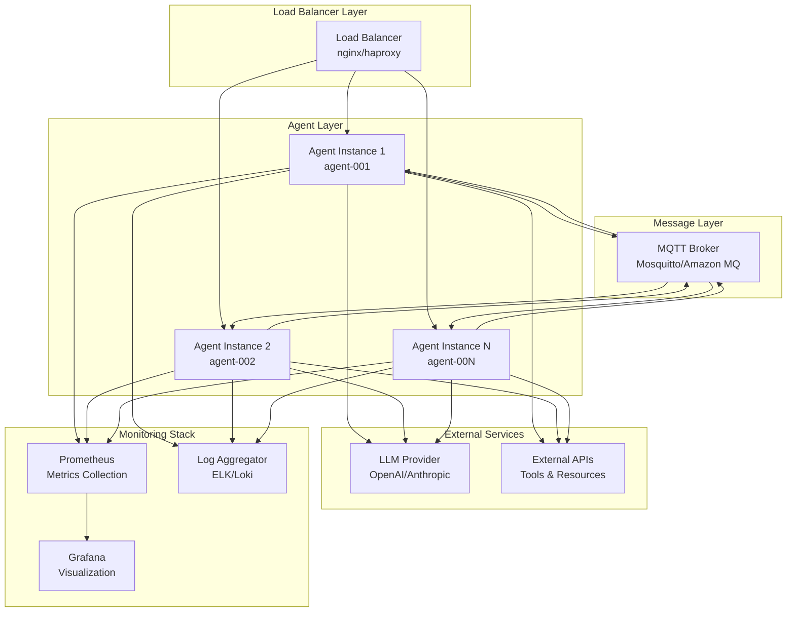
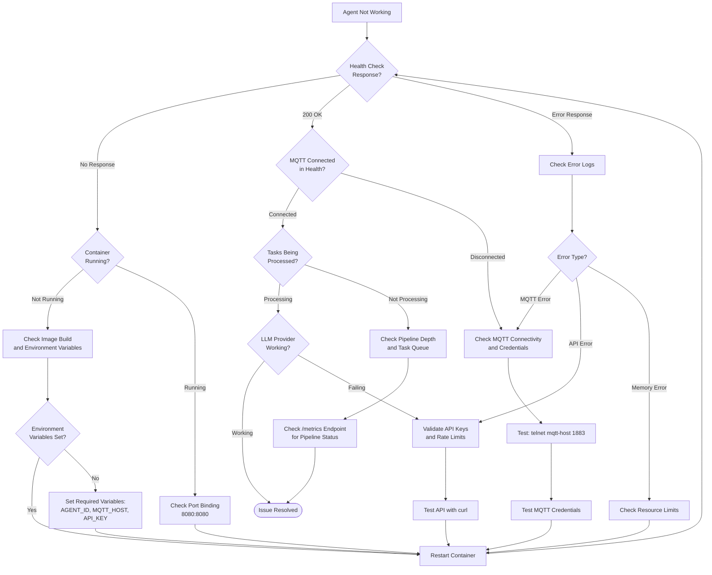

# 2389 Agent Protocol - Deployment Guide

This guide covers deploying the 2389 Agent Protocol implementation in production environments.

## Table of Contents

- [Overview](#overview)
- [Quick Start](#quick-start)
- [Prerequisites](#prerequisites)
- [System Architecture](#system-architecture)
- [Configuration](#configuration)
- [Docker Deployment](#docker-deployment)
- [Kubernetes Deployment](#kubernetes-deployment)
- [Health Monitoring](#health-monitoring)
- [Logging & Metrics](#logging--metrics)
- [Security Considerations](#security-considerations)
- [Troubleshooting](#troubleshooting)
- [Production Checklist](#production-checklist)

## Overview

The 2389 Agent Protocol implementation provides a production-ready agent system with:

- MQTT-based communication with QoS 1 guarantees
- Structured logging and comprehensive metrics
- Health check endpoints for container orchestration
- Configurable tool execution pipeline
- Multiple LLM provider support

## Quick Start

For local testing and development, use this minimal setup:

```bash
# 1. Start local MQTT broker
docker run -d --name mosquitto -p 1883:1883 eclipse-mosquitto:2

# 2. Set required environment variables
export AGENT_ID=test-agent-001
export MQTT_HOST=localhost
export OPENAI_API_KEY=sk-your-key-here

# 3. Run the agent
docker run -d \
  --name agent2389-test \
  -p 8080:8080 \
  -e AGENT_ID=${AGENT_ID} \
  -e MQTT_HOST=host.docker.internal \
  -e OPENAI_API_KEY=${OPENAI_API_KEY} \
  agent2389:latest

# 4. Verify it's working
curl http://localhost:8080/health
```

## Prerequisites

### System Requirements

**Baseline Deployment (Single Agent):**

- **CPU**: 2+ cores (Intel x64 or ARM64)
- **Memory**: 1GB RAM minimum, 2GB recommended
- **Storage**: 500MB for container + 1GB for logs/metrics
- **Network**: Stable internet connection, 10Mbps minimum bandwidth

**Scaled Deployment (Multiple Agents):**

- **CPU**: 4+ cores per 5 agents
- **Memory**: 4GB RAM minimum, 8GB recommended
- **Storage**: 2GB base + 500MB per additional agent
- **Network**: 100Mbps+ for high-throughput scenarios

### External Dependencies

**Required Dependencies with Minimum Versions:**

- **MQTT Broker**: Eclipse Mosquitto 2.0+, Amazon MQ 5.15+, or compatible broker supporting MQTT 3.1.1
- **LLM Provider**: OpenAI API (GPT-3.5/4) or Anthropic Claude API access
- **Container Runtime**: Docker 20.10+ or Podman 4.0+

**Optional Dependencies:**

- **Kubernetes**: 1.21+ (for orchestrated deployments)
- **Monitoring**: Prometheus 2.30+, Grafana 8.0+ (recommended for production)
- **TLS Certificates**: For MQTT over TLS (mqtts://)

## System Architecture



## Configuration

### Environment Variables

The agent supports configuration through environment variables:

```bash
# Core Agent Configuration
AGENT_ID=prod-agent-001              # Required: Unique agent identifier
DEFAULT_MODEL=gpt-4                  # Required: LLM model name
MAX_PIPELINE_DEPTH=16                # Optional: Max concurrent tasks (1-32)
TASK_TIMEOUT=300                     # Optional: Task timeout in seconds (30-3600)

# MQTT Configuration
MQTT_HOST=mqtt.example.com           # Required: MQTT broker hostname/IP
MQTT_PORT=1883                       # Optional: MQTT broker port (1883/8883)
MQTT_USERNAME=agent_user             # Required: MQTT authentication username
MQTT_PASSWORD=secret_password        # Required: MQTT authentication password

# LLM Provider Configuration (choose one)
OPENAI_API_KEY=sk-...               # OpenAI API key (starts with 'sk-')
# ANTHROPIC_API_KEY=sk-ant-...       # Anthropic API key (starts with 'sk-ant-')

# Observability
LOG_LEVEL=INFO                       # Optional: ERROR|WARN|INFO|DEBUG
LOG_FORMAT=json                      # Optional: json|text
LOG_SPANS=false                      # Optional: Enable tracing spans
HEALTH_PORT=8080                     # Optional: Health check port (1024-65535)

# Validation Rules:
# - AGENT_ID: 3-64 characters, alphanumeric and hyphens only
# - MQTT_HOST: Valid hostname or IP address
# - MQTT_PORT: Valid port number (1-65535)
# - API keys must match provider format patterns
# - LOG_LEVEL must be one of the specified values
```

### Configuration File (agent.toml)

```toml
# Production agent configuration
agent_id = "${AGENT_ID:-prod-agent-001}"
default_model = "${DEFAULT_MODEL:-gpt-4}"
max_pipeline_depth = 16
task_timeout = 300
max_output_size = 1048576

[mqtt]
broker_url = "mqtt://${MQTT_HOST:-localhost}:${MQTT_PORT:-1883}"
username = "${MQTT_USERNAME}"
password = "${MQTT_PASSWORD}"
qos = 1
keep_alive = 60

[llm]
openai_api_key = "${OPENAI_API_KEY}"

# Production tool configuration
[[tools]]
name = "http_get"
command = "curl"
timeout = 30
[tools.schema]
type = "object"
properties = { url = { type = "string", format = "uri" } }
required = ["url"]
```

## Docker Deployment

### Basic Docker Run

```bash
# Build the image
docker build -t agent2389:latest .

# Run with environment variables
docker run -d \
  --name agent2389 \
  --restart unless-stopped \
  -p 8080:8080 \
  -e AGENT_ID=prod-agent-001 \
  -e MQTT_HOST=mqtt.example.com \
  -e OPENAI_API_KEY=sk-... \
  -v ./config:/app/config:ro \
  -v ./logs:/app/logs \
  agent2389:latest
```

### Docker Compose

```yaml
version: '3.8'

services:
  agent2389:
    build: .
    image: agent2389:latest
    container_name: agent2389
    restart: unless-stopped
    ports:
      - "8080:8080"
    environment:
      - AGENT_ID=prod-agent-001
      - DEFAULT_MODEL=gpt-4
      - MQTT_HOST=mqtt.example.com
      - MQTT_PORT=1883
      - OPENAI_API_KEY=${OPENAI_API_KEY}
      - LOG_LEVEL=INFO
      - LOG_FORMAT=json
    volumes:
      - ./config/agent.toml:/app/config/agent.toml:ro
      - ./logs:/app/logs
    healthcheck:
      test: ["CMD", "wget", "--no-verbose", "--tries=1", "--spider", "http://localhost:8080/health"]
      interval: 30s
      timeout: 10s
      retries: 3
      start_period: 60s
    # Alternative for minimal containers without wget:
    # test: ["CMD", "/bin/sh", "-c",
    #        "exec 3<>/dev/tcp/localhost/8080 && echo -e 'GET /health HTTP/1.1\\r\\nHost: localhost\\r\\nConnection: close\\r\\n\\r\\n' >&3 && grep -q '200 OK' <&3"]
    depends_on:
      - mqtt

  mqtt:
    image: eclipse-mosquitto:2
    container_name: mosquitto
    restart: unless-stopped
    ports:
      - "1883:1883"
      - "9001:9001"
    volumes:
      - ./mosquitto/config:/mosquitto/config
      - ./mosquitto/data:/mosquitto/data
      - ./mosquitto/log:/mosquitto/log

  # Optional: Prometheus for metrics
  prometheus:
    image: prom/prometheus:latest
    container_name: prometheus
    ports:
      - "9090:9090"
    volumes:
      - ./prometheus.yml:/etc/prometheus/prometheus.yml:ro
```

## Kubernetes Deployment

### Namespace and ConfigMap

```yaml
apiVersion: v1
kind: Namespace
metadata:
  name: agent2389
---
apiVersion: v1
kind: ConfigMap
metadata:
  name: agent2389-config
  namespace: agent2389
data:
  agent.toml: |
    agent_id = "${AGENT_ID}"
    default_model = "${DEFAULT_MODEL:-gpt-4}"
    max_pipeline_depth = 16
    task_timeout = 300
    
    [mqtt]
    broker_url = "mqtt://${MQTT_HOST}:${MQTT_PORT:-1883}"
    username = "${MQTT_USERNAME}"
    password = "${MQTT_PASSWORD}"
    qos = 1
    
    [llm]
    openai_api_key = "${OPENAI_API_KEY}"
```

### Secret for Sensitive Data

```yaml
apiVersion: v1
kind: Secret
metadata:
  name: agent2389-secrets
  namespace: agent2389
type: Opaque
stringData:
  openai-api-key: "sk-your-openai-key-here"
  mqtt-username: "agent_user"
  mqtt-password: "secret_password"
```

### Deployment

```yaml
apiVersion: apps/v1
kind: Deployment
metadata:
  name: agent2389
  namespace: agent2389
  labels:
    app: agent2389
spec:
  replicas: 2
  selector:
    matchLabels:
      app: agent2389
  template:
    metadata:
      labels:
        app: agent2389
    spec:
      containers:
      - name: agent2389
        image: agent2389:latest
        ports:
        - containerPort: 8080
          name: health
        env:
        - name: AGENT_ID
          valueFrom:
            fieldRef:
              fieldPath: metadata.name
        - name: MQTT_HOST
          value: "mqtt-service"
        - name: MQTT_PORT
          value: "1883"
        - name: OPENAI_API_KEY
          valueFrom:
            secretKeyRef:
              name: agent2389-secrets
              key: openai-api-key
        - name: MQTT_USERNAME
          valueFrom:
            secretKeyRef:
              name: agent2389-secrets
              key: mqtt-username
        - name: MQTT_PASSWORD
          valueFrom:
            secretKeyRef:
              name: agent2389-secrets
              key: mqtt-password
        - name: LOG_LEVEL
          value: "INFO"
        - name: LOG_FORMAT
          value: "json"
        volumeMounts:
        - name: config
          mountPath: /app/config
          readOnly: true
        livenessProbe:
          httpGet:
            path: /live
            port: 8080
          initialDelaySeconds: 30
          periodSeconds: 30
        readinessProbe:
          httpGet:
            path: /ready
            port: 8080
          initialDelaySeconds: 5
          periodSeconds: 10
        resources:
          requests:
            memory: "512Mi"
            cpu: "250m"
          limits:
            memory: "1Gi"
            cpu: "500m"
      volumes:
      - name: config
        configMap:
          name: agent2389-config
---
apiVersion: v1
kind: Service
metadata:
  name: agent2389-service
  namespace: agent2389
spec:
  selector:
    app: agent2389
  ports:
  - name: health
    port: 8080
    targetPort: 8080
  type: ClusterIP
```

### Horizontal Pod Autoscaler

```yaml
apiVersion: autoscaling/v2
kind: HorizontalPodAutoscaler
metadata:
  name: agent2389-hpa
  namespace: agent2389
spec:
  scaleTargetRef:
    apiVersion: apps/v1
    kind: Deployment
    name: agent2389
  minReplicas: 2
  maxReplicas: 10
  metrics:
  - type: Resource
    resource:
      name: cpu
      target:
        type: Utilization
        averageUtilization: 70
  - type: Resource
    resource:
      name: memory
      target:
        type: Utilization
        averageUtilization: 80
```

## Health Monitoring

### Health Check Endpoints

The agent exposes several HTTP endpoints for monitoring:

- **`/health`** - Comprehensive health status with detailed checks
- **`/ready`** - Kubernetes readiness probe (MQTT connection status)
- **`/live`** - Kubernetes liveness probe (always returns OK if responding)
- **`/metrics`** - Complete metrics snapshot (JSON format)

### Example Health Response

```json
{
  "status": "healthy",
  "timestamp": 1703123456,
  "agent_id": "prod-agent-001",
  "uptime_seconds": 3600,
  "checks": {
    "mqtt": {
      "status": "healthy",
      "message": "MQTT connection established",
      "last_check": 1703123456
    },
    "task_processing": {
      "status": "healthy", 
      "message": "Recent task activity",
      "last_check": 1703123456
    }
  }
}
```

### Prometheus Metrics Integration

The `/metrics` endpoint provides JSON metrics that can be scraped by Prometheus using the `json_exporter`:

#### Step 1: Deploy json_exporter

```yaml
# docker-compose.yml addition
  json-exporter:
    image: prometheuscommunity/json-exporter:latest
    container_name: json-exporter
    ports:
      - "7979:7979"
    volumes:
      - ./json-exporter.yml:/json-exporter.yml:ro
    command: --config.file=/json-exporter.yml
```

#### Step 2: Configure json_exporter

```yaml
# json-exporter.yml
modules:
  agent2389:
    metrics:
    - name: agent_tasks_processing
      path: $.tasks.tasks_processing
      type: gauge
    - name: agent_mqtt_connected  
      path: $.mqtt.connected
      type: gauge
    - name: agent_avg_processing_time_ms
      path: $.tasks.avg_processing_time_ms
      type: gauge
    - name: agent_uptime_seconds
      path: $.uptime_seconds
      type: gauge
```

#### Step 3: Configure Prometheus

```yaml
# prometheus.yml
scrape_configs:
- job_name: 'agent2389-metrics'
  static_configs:
  - targets: ['json-exporter:7979']
  metrics_path: /probe
  params:
    module: [agent2389]
    target: ['http://agent2389:8080/metrics']
  scrape_interval: 30s
  relabel_configs:
  - source_labels: [__param_target]
    target_label: __param_target
  - source_labels: [__param_target]
    target_label: instance
  - target_label: __address__
    replacement: json-exporter:7979
```

## Logging & Metrics

### Structured Logging

The agent uses structured JSON logging in production:

```json
{
  "timestamp": "2024-01-01T12:00:00Z",
  "level": "INFO",
  "target": "agent2389::transport::mqtt",
  "span": {
    "operation": "publish_status",
    "topic": "/control/agents/prod-agent-001/status",
    "agent_id": "prod-agent-001"
  },
  "fields": {
    "message": "Published agent status"
  }
}
```

### Log Levels

- **ERROR**: Critical errors requiring immediate attention
- **WARN**: Warning conditions that should be investigated
- **INFO**: General operational messages (default production level)
- **DEBUG**: Detailed debugging information (development only)

### Key Metrics

The agent tracks comprehensive metrics:

**Task Processing:**

- Tasks received/processed/completed/failed
- Processing time percentiles (P50, P95, P99)
- Current pipeline depth

**MQTT Transport:**

- Connection status and attempts
- Message publish/receive counts
- Connection duration and heartbeat

**Tool Execution:**

- Per-tool execution statistics
- Success rates and timeout counts
- Average execution times

## Security Considerations

### Network Security

1. **MQTT Security:**
   - Use TLS encryption (port 8883) for production
   - Implement client certificate authentication
   - Restrict broker access with firewall rules

   **Client Certificate Setup Example:**

   ```bash
   # Generate CA certificate (one time)
   openssl genrsa -out ca.key 2048
   openssl req -new -x509 -key ca.key -out ca.crt -days 365 \
     -subj "/C=US/ST=CA/L=SF/O=Agent2389/CN=mqtt-ca"
   
   # Generate client certificate for agent
   openssl genrsa -out agent-client.key 2048
   openssl req -new -key agent-client.key -out agent-client.csr \
     -subj "/C=US/ST=CA/L=SF/O=Agent2389/CN=agent-001"
   openssl x509 -req -in agent-client.csr -CA ca.crt -CAkey ca.key \
     -out agent-client.crt -days 365 -CAcreateserial
   
   # Configure Mosquitto with TLS
   # mosquitto.conf
   port 8883
   cafile /mosquitto/config/ca.crt
   certfile /mosquitto/config/server.crt
   keyfile /mosquitto/config/server.key
   require_certificate true
   use_identity_as_username true
   ```

   **Agent Configuration for TLS:**

   ```toml
   # agent.toml
   [mqtt]
   broker_url = "mqtts://mqtt.example.com:8883"
   ca_cert_path = "/app/certs/ca.crt"
   client_cert_path = "/app/certs/agent-client.crt"
   client_key_path = "/app/certs/agent-client.key"
   ```

2. **API Keys:**
   - Store LLM API keys in secrets management (Kubernetes secrets, AWS Secrets Manager, etc.)
   - Rotate API keys regularly
   - Use least-privilege API key permissions

3. **Container Security:**
   - Run as non-root user (UID 10001 in Dockerfile)
   - Use read-only filesystem where possible
   - Keep base images updated

### Access Control

```yaml
# Kubernetes RBAC example
apiVersion: rbac.authorization.k8s.io/v1
kind: Role
metadata:
  namespace: agent2389
  name: agent2389-role
rules:
- apiGroups: [""]
  resources: ["configmaps", "secrets"]
  verbs: ["get", "list"]
---
apiVersion: rbac.authorization.k8s.io/v1
kind: RoleBinding
metadata:
  name: agent2389-binding
  namespace: agent2389
subjects:
- kind: ServiceAccount
  name: agent2389-serviceaccount
  namespace: agent2389
roleRef:
  kind: Role
  name: agent2389-role
  apiGroup: rbac.authorization.k8s.io
```

## Troubleshooting

### Troubleshooting Flowchart



### Common Issues

1. **MQTT Connection Failed**

   ```bash
   # Check connectivity
   telnet mqtt-broker 1883
   
   # Verify credentials using Docker (preferred method)
   docker run --rm -it eclipse-mosquitto:2 mosquitto_pub \
     -h mqtt-broker -t test -m "hello" -u username -P password
   
   # Alternative: Install mosquitto-clients locally
   # mosquitto_pub -h mqtt-broker -t test -m "hello" -u username -P password
   ```

2. **High Memory Usage**

   ```bash
   # Check pipeline depth
   curl http://localhost:8080/metrics | jq '.tasks.current_pipeline_depth'
   
   # Adjust max_pipeline_depth in configuration
   ```

3. **LLM API Errors**

   ```bash
   # Check OpenAI API key validity
   curl -H "Authorization: Bearer $OPENAI_API_KEY" \
     -H "Content-Type: application/json" \
     https://api.openai.com/v1/models
   
   # Check Anthropic API key validity
   curl -H "x-api-key: $ANTHROPIC_API_KEY" \
     -H "Content-Type: application/json" \
     -H "anthropic-version: 2023-06-01" \
     https://api.anthropic.com/v1/messages \
     -d '{"model":"claude-3-haiku-20240307","max_tokens":10,"messages":[{"role":"user","content":"test"}]}'
   
   # Verify rate limits and API errors in logs
   docker logs agent2389 2>&1 | grep -E "(rate limit|API error|401|429)"
   ```

### Log Analysis

```bash
# Filter error logs
docker logs agent2389 2>&1 | jq 'select(.level=="ERROR")'

# Monitor task processing
docker logs agent2389 2>&1 | jq 'select(.span.operation=="task_processing")'

# Check MQTT operations
docker logs agent2389 2>&1 | jq 'select(.target | contains("mqtt"))'
```

### Performance Monitoring

```bash
# Check current metrics
curl -s http://localhost:8080/metrics | jq '{
  tasks_processing: .tasks.tasks_processing,
  mqtt_connected: .mqtt.connected,
  avg_processing_time: .tasks.avg_processing_time_ms
}'

# Monitor health status
while true; do
  curl -s http://localhost:8080/health | jq '.status'
  sleep 30
done
```

### Debug Mode

For troubleshooting, you can run the agent with debug logging:

```bash
# Docker
docker run -e LOG_LEVEL=DEBUG -e LOG_SPANS=true agent2389:latest

# Direct execution
LOG_LEVEL=DEBUG LOG_SPANS=true ./target/release/agent2389 run
```

## Scaling Considerations

### Horizontal Scaling

- Multiple agent instances can run with unique `agent_id` values
- Each agent subscribes to its own MQTT input topic
- Load balancing happens naturally through MQTT topic routing

### Resource Planning

- **CPU**: Primarily used for LLM API calls and tool execution
- **Memory**: Scales with pipeline depth and tool complexity
- **Network**: MQTT bandwidth depends on task frequency and payload size

## Production Checklist

### Security & Authentication

- [ ] **MQTT TLS Configuration**: Enable TLS on MQTT broker (port 8883) and configure client certificates
- [ ] **API Key Management**: Store LLM API keys in Kubernetes secrets or cloud secret managers
      (not environment variables)
- [ ] **Access Control**: Implement RBAC for Kubernetes deployments and network policies for pod-to-pod communication  
- [ ] **Certificate Management**: Set up automated certificate rotation for TLS endpoints
- [ ] **Vulnerability Scanning**: Enable container image scanning and regular security audits

### Operational Readiness

- [ ] **Health Monitoring**: Configure health checks (`/health`, `/ready`, `/live`) in load balancers and orchestrators
- [ ] **Log Aggregation**: Set up centralized logging with ELK stack, Loki, or cloud logging services
- [ ] **Metrics Collection**: Deploy Prometheus with json_exporter for metrics scraping and Grafana dashboards
- [ ] **Alerting Rules**: Configure alerts for high error rates, MQTT disconnections, and resource exhaustion
- [ ] **Resource Limits**: Set appropriate CPU/memory requests and limits based on workload testing

### Scalability & Performance

- [ ] **Horizontal Scaling**: Configure HPA with CPU/memory targets and test scaling behavior
- [ ] **Load Testing**: Establish performance baselines and maximum throughput limits
- [ ] **Resource Planning**: Document resource requirements per agent instance and scaling factors
- [ ] **Pipeline Optimization**: Tune `max_pipeline_depth` based on actual workload patterns

### Disaster Recovery & Business Continuity

- [ ] **Backup Strategy**: Implement automated backups of configuration and state data
- [ ] **Multi-Region Setup**: Deploy across multiple availability zones or regions for high availability
- [ ] **Recovery Procedures**: Document and test disaster recovery procedures including data restoration
- [ ] **Dependency Failover**: Configure MQTT broker clustering and LLM provider failover mechanisms

### Compliance & Documentation

- [ ] **Deployment Documentation**: Maintain up-to-date runbooks and architecture diagrams
- [ ] **Change Management**: Implement proper CI/CD pipelines with automated testing
- [ ] **Capacity Planning**: Regular review of resource usage trends and scaling requirements
- [ ] **Incident Response**: Define escalation procedures and on-call rotation for critical issues

---

## See Also

### Before Deploying

- **[Getting Started Guide](GETTING_STARTED.md)** - Development setup and local testing
- **[Configuration Reference](CONFIGURATION_REFERENCE.md)** - All configuration options for production
- **[Testing Guide](TESTING.md)** - Pre-deployment validation procedures

### During Deployment

- **[Architecture Overview](ARCHITECTURE.md)** - System design and component interactions
- **[TaskEnvelope Protocol](TASKENVELOPE_PROTOCOL.md)** - Protocol compliance requirements
- **[Agent Capabilities](AGENT_CAPABILITIES.md)** - Capability-based routing configuration

### After Deployment

- **[Observability Guide](OBSERVABILITY.md)** - Monitoring, metrics, and logging
- **[Troubleshooting Guide](TROUBLESHOOTING.md)** - Production issue diagnosis
- **[CLI Tools Reference](CLI_TOOLS.md)** - mqtt-monitor and diagnostic tools for production
