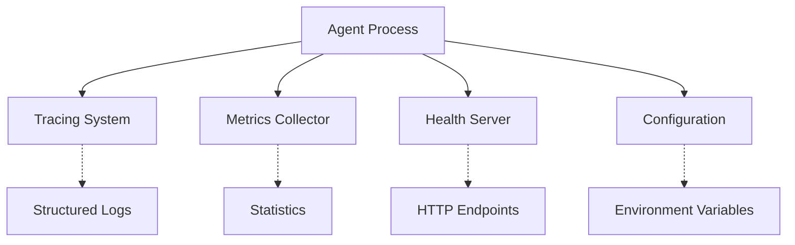
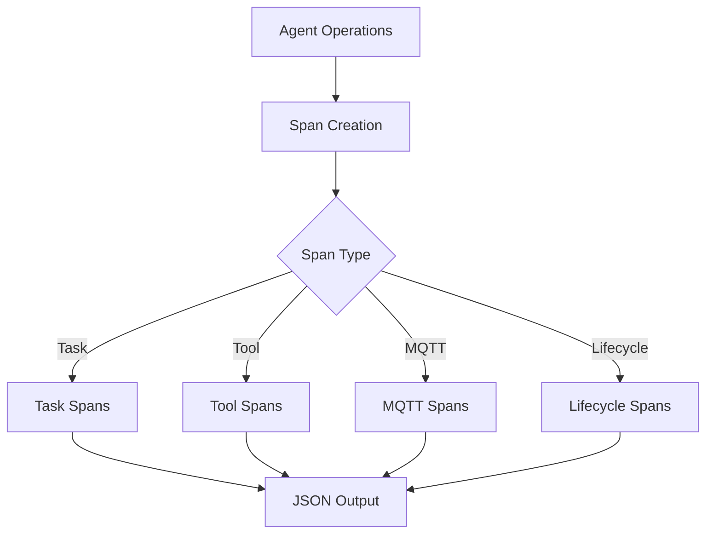
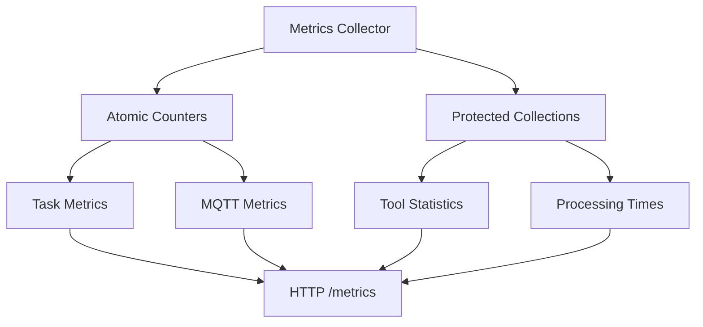
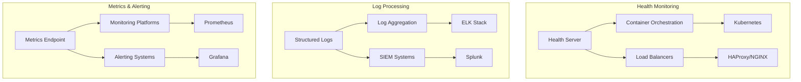

# 2389 Agent Protocol - Observability System

Comprehensive technical documentation for the structured logging, metrics collection, and health monitoring system.

## Table of Contents

- [System Overview](#system-overview)
- [Structured Logging System](#structured-logging-system)
- [Metrics Collection System](#metrics-collection-system)
- [Health Check Endpoints](#health-check-endpoints)
- [Production Deployment](#production-deployment)
- [Configuration Reference](#configuration-reference)
- [Development & Debugging](#development--debugging)
- [Troubleshooting Guide](#troubleshooting-guide)
- [Best Practices](#best-practices)

## System Overview

The 2389 Agent Protocol observability system provides three complementary monitoring capabilities:

1. **Structured Logging**: Contextual, machine-readable logs using the `tracing` crate
2. **Metrics Collection**: Thread-safe atomic counters and statistics for operational insights  
3. **Health Endpoints**: HTTP endpoints for container orchestration and monitoring systems

### Key Dependencies

The observability system relies on these core Rust crates:

- **`tracing`** - Structured logging and distributed tracing
- **`tracing-subscriber`** - Log formatting and filtering
- **`once_cell`** - Global metrics collector initialization
- **`serde_json`** - JSON serialization for metrics and health endpoints
- **`tokio`** - Async HTTP server for health checks

### Architecture

The observability system is designed with four key components that work together to provide comprehensive monitoring
capabilities:

#### Core System Components



#### Structured Logging Flow



#### Metrics Collection Architecture



#### External Integration Points



## Structured Logging System

### Overview

The logging system uses the `tracing` crate to provide structured, contextual logging with support for distributed
tracing. It supports both JSON format for production and pretty-printed format for development.

### Configuration

#### Environment Variables

```bash
# Log level (ERROR, WARN, INFO, DEBUG, TRACE)
LOG_LEVEL=INFO

# Output format: 'json' for production, 'pretty' for development  
LOG_FORMAT=json

# Include span enter/exit events for performance analysis
LOG_SPANS=true
```

#### Initialization

```rust
use tracing::Level;
use agent2389::observability::logging::{init_logging, init_default_logging};

// Manual initialization
init_logging(Level::INFO, true, false);

// Or use environment-based initialization
init_default_logging();
```

### Span Macros

The system provides specialized macros for creating contextual spans:

#### Task Processing Spans

```rust
use agent2389::task_span;
use uuid::Uuid;

let task_id = Uuid::new_v4();
let span = task_span!(
    task_id = %task_id,
    conversation_id = "conv-123",
    agent_id = "my-agent"
);

let _enter = span.enter();
// All logging within this scope will include task context
tracing::info!("Processing task");
tracing::error!("Task failed with error: {}", error);
```

**JSON Output:**

```json
{
  "timestamp": "2024-01-01T12:00:00Z",
  "level": "INFO",
  "target": "agent2389::agent::processor",
  "span": {
    "name": "task_processing",
    "task_id": "550e8400-e29b-41d4-a716-446655440000",
    "conversation_id": "conv-123", 
    "agent_id": "my-agent"
  },
  "fields": {
    "message": "Processing task"
  }
}
```

#### Tool Execution Spans

```rust
use agent2389::tool_span;

let span = tool_span!(
    tool_name = "http_get",
    task_id = %task_id,
    timeout = 30
);

let _enter = span.enter();
tracing::info!("Executing tool");
tracing::warn!(execution_time_ms = 1500, "Tool execution took longer than expected");
```

#### MQTT Operation Spans

```rust
use agent2389::mqtt_span;

let span = mqtt_span!(
    operation = "publish_status",
    topic = "/control/agents/my-agent/status",
    agent_id = "my-agent"
);

let _enter = span.enter();
tracing::info!("Publishing to MQTT");
```

#### Lifecycle Event Spans

```rust
use agent2389::lifecycle_span;

let span = lifecycle_span!(
    event = "state_transition",
    agent_id = "my-agent",
    from_state = "initializing", 
    to_state = "running"
);

let _enter = span.enter();
tracing::info!("Agent state changed");
```

### Log Filtering

The system automatically reduces noise from dependencies:

```rust
// Configured in init_logging()
.add_directive("rumqttc=warn".parse().unwrap())    // MQTT client
.add_directive("hyper=warn".parse().unwrap())      // HTTP client  
.add_directive("tokio=warn".parse().unwrap())      // Async runtime
```

Custom filtering via `RUST_LOG`:

```bash
# Show only agent logs at debug level, everything else at warn
RUST_LOG="agent2389=debug,warn" ./agent2389
```

### Span Events

Enable span events for performance profiling:

```bash
LOG_SPANS=true
```

**Output includes timing information:**

```json
{
  "timestamp": "2024-01-01T12:00:00Z",
  "level": "TRACE",
  "target": "agent2389::agent::processor", 
  "span": {
    "name": "task_processing",
    "elapsed_milliseconds": 1247
  },
  "fields": {
    "message": "close",
    "time.busy": "1.247s",
    "time.idle": "23.4μs"
  }
}
```

## Metrics Collection System

### Overview

The metrics system uses thread-safe atomic counters and mutex-protected collections to track operational statistics.
It provides comprehensive insights into task processing, MQTT transport, tool execution, and system health.

### Architecture

```rust
// Global metrics collector
use agent2389::observability::metrics;

let collector = metrics(); // Returns &'static MetricsCollector
```

The metrics collector uses:

- **Atomic counters** for high-frequency operations (task counts, message counts)
- **Mutex-protected collections** for complex data (processing times, tool statistics)
- **Thread-safe design** allowing concurrent updates from multiple threads

### Task Processing Metrics

#### Recording Task Events

```rust
use agent2389::observability::metrics;
use std::time::{Duration, Instant};

let collector = metrics();

// Task received
collector.task_received();

// Task processing started
collector.task_processing_started();

// Task completed successfully
let start_time = Instant::now();
// ... process task ...
let duration = start_time.elapsed();
collector.task_processing_completed(duration);

// Task failed
// let duration = start_time.elapsed();
// collector.task_processing_failed(duration);

// Task rejected (validation failed)
// collector.task_rejected();
```

#### Available Task Metrics

```rust
pub struct TaskMetrics {
    pub tasks_received: u64,           // Total tasks received
    pub tasks_processing: u64,         // Currently processing  
    pub tasks_completed: u64,          // Successfully completed
    pub tasks_failed: u64,             // Processing failures
    pub tasks_rejected: u64,           // Validation failures
    pub avg_processing_time_ms: f64,   // Average processing time
    pub processing_time_p50_ms: f64,   // 50th percentile
    pub processing_time_p95_ms: f64,   // 95th percentile  
    pub processing_time_p99_ms: f64,   // 99th percentile
    pub current_pipeline_depth: u32,   // Active tasks
    pub max_pipeline_depth_reached: u32, // Peak concurrency
}
```

### MQTT Transport Metrics

#### Recording MQTT Events

```rust
let collector = metrics();

// Connection lifecycle
collector.mqtt_connection_attempt();
collector.mqtt_connection_established(); 
collector.mqtt_connection_failed();

// Message operations
collector.mqtt_message_published();
collector.mqtt_publish_failed();
collector.mqtt_message_received();

// Heartbeat tracking
collector.mqtt_heartbeat();
```

#### Available MQTT Metrics

```rust
pub struct MqttMetrics {
    pub connected: bool,                    // Current connection status
    pub connection_attempts: u64,           // Total connection attempts
    pub connections_established: u64,       // Successful connections
    pub connection_failures: u64,           // Connection failures
    pub messages_published: u64,            // Messages sent
    pub publish_failures: u64,              // Publish failures
    pub messages_received: u64,             // Messages received
    pub last_heartbeat: u64,                // Last heartbeat timestamp
    pub connection_duration_seconds: u64,   // Current connection uptime
}
```

### Tool Execution Metrics

#### Recording Tool Events

```rust
use std::time::{Duration, Instant};

let collector = metrics();
let start_time = Instant::now();

// Execute tool...
let duration = start_time.elapsed();
let success = true; // or false based on execution result

collector.tool_executed("http_get", duration, success);

// For timeouts specifically
// collector.tool_timeout("http_get");
```

#### Per-Tool Statistics

The system maintains detailed statistics for each tool:

```rust
pub struct ToolExecutionStats {
    pub name: String,                    // Tool name
    pub executions: u64,                 // Total executions
    pub failures: u64,                   // Execution failures
    pub timeouts: u64,                   // Timeout occurrences
    pub avg_execution_time_ms: f64,      // Average execution time
    pub last_execution: u64,             // Last execution timestamp
    pub success_rate: f64,               // Success rate (0.0 to 1.0)
}
```

#### Aggregate Tool Metrics

```rust
pub struct ToolMetrics {
    pub tool_stats: HashMap<String, ToolExecutionStats>, // Per-tool stats
    pub total_executions: u64,          // All tool executions
    pub total_failures: u64,            // All failures
    pub total_timeouts: u64,            // All timeouts
    pub avg_execution_time_ms: f64,     // Average across all tools
}
```

### System & Lifecycle Metrics

#### Agent State Management

```rust
let collector = metrics();

// Update agent state
collector.set_agent_state("running");
collector.set_agent_state("stopping");
collector.set_agent_state("error");
```

#### Lifecycle Metrics

```rust
pub struct LifecycleMetrics {
    pub current_state: String,          // Current agent state
    pub uptime_seconds: u64,            // Agent uptime
    pub state_transitions: u64,         // State change count
    pub restarts: u64,                  // Restart count  
    pub healthy: bool,                  // Overall health status
    pub last_health_check: u64,         // Last health check
}
```

#### System Resource Metrics

```rust
pub struct SystemMetrics {
    pub memory_used_bytes: u64,         // Memory usage
    pub cpu_usage_percent: f64,         // CPU utilization
    pub active_threads: u64,            // Thread count
    pub active_tasks: u64,              // Async task count
}
```

### Retrieving Metrics

#### Get Complete Metrics Snapshot

```rust
use agent2389::observability::metrics;

let collector = metrics();
let snapshot = collector.get_metrics();

println!("Tasks completed: {}", snapshot.tasks.tasks_completed);
println!("MQTT connected: {}", snapshot.mqtt.connected);
println!("Average processing time: {:.2}ms", snapshot.tasks.avg_processing_time_ms);

// Iterate over tool statistics
for (tool_name, stats) in &snapshot.tools.tool_stats {
    println!("Tool {}: {}% success rate", tool_name, stats.success_rate * 100.0);
}
```

#### Reset Metrics

```rust
// Reset all counters (useful for testing)
collector.reset();
```

### Thread Safety

The metrics collector is designed for high-concurrency usage:

```rust
use std::sync::Arc;
use std::thread;

let collector = Arc::new(metrics());

// Spawn multiple threads updating metrics
for i in 0..10 {
    let collector_clone = Arc::clone(&collector);
    thread::spawn(move || {
        for _ in 0..1000 {
            collector_clone.task_received();
            collector_clone.mqtt_message_published();
        }
    });
}

// Metrics are safely aggregated across all threads
```

### Memory Management

The system prevents unbounded memory growth:

- **Processing times**: Limited to last 1000 measurements
- **Tool statistics**: Bounded by number of unique tools used
- **Atomic counters**: Fixed memory footprint

## Health Check Endpoints

### Overview

The health system provides HTTP endpoints for monitoring agent status, supporting both human operators and container
orchestration platforms like Kubernetes.

### Server Configuration

```rust
use agent2389::health::HealthServer;

// Create health server
let health_server = HealthServer::new("my-agent".to_string(), 8080);

// Update status from other parts of the system
health_server.set_mqtt_connected(true).await;
health_server.set_last_task_processed(timestamp).await;

// Start HTTP server (blocking)
health_server.start().await?;
```

### Environment Configuration

```bash
# Health check server port
HEALTH_PORT=8080

# Agent ID for health responses
AGENT_ID=prod-agent-001
```

### Available Endpoints

#### `/health` - Comprehensive Health Status

Returns detailed health information with individual check results.

**Request:**

```bash
curl http://localhost:8080/health
```

**Response (200 OK when healthy):**

```json
{
  "status": "healthy",
  "timestamp": 1703123456,
  "agent_id": "prod-agent-001", 
  "uptime_seconds": 3600,
  "checks": {
    "mqtt": {
      "status": "healthy",
      "message": "MQTT connection established",
      "last_check": 1703123456
    },
    "task_processing": {
      "status": "healthy",
      "message": "Recent task activity", 
      "last_check": 1703123456
    }
  }
}
```

**Response (503 Service Unavailable when unhealthy):**

```json
{
  "status": "degraded",
  "timestamp": 1703123456,
  "agent_id": "prod-agent-001",
  "uptime_seconds": 3600, 
  "checks": {
    "mqtt": {
      "status": "unhealthy",
      "message": "MQTT connection failed",
      "last_check": 1703123456
    },
    "task_processing": {
      "status": "stale", 
      "message": "No task activity for 450 seconds",
      "last_check": 1703123456
    }
  }
}
```

#### `/ready` - Kubernetes Readiness Probe

Returns readiness status based on MQTT connectivity.

**Request:**

```bash
curl http://localhost:8080/ready
```

**Response (200 OK when ready):**

```json
{
  "ready": true,
  "timestamp": 1703123456
}
```

**Response (503 Service Unavailable when not ready):**

```json
{
  "ready": false,
  "timestamp": 1703123456
}
```

#### `/live` - Kubernetes Liveness Probe

Always returns OK if the HTTP server is responding.

**Request:**

```bash
curl http://localhost:8080/live
```

**Response (Always 200 OK):**

```json
{
  "alive": true,
  "timestamp": 1703123456
}
```

#### `/metrics` - Complete Metrics Export

Returns the complete metrics snapshot in JSON format.

**Request:**

```bash
curl http://localhost:8080/metrics
```

**Response:**

```json
{
  "tasks": {
    "tasks_received": 1250,
    "tasks_processing": 3,
    "tasks_completed": 1200,
    "tasks_failed": 47,
    "tasks_rejected": 15,
    "avg_processing_time_ms": 1247.5,
    "processing_time_p50_ms": 892.0,
    "processing_time_p95_ms": 3200.0,
    "processing_time_p99_ms": 5100.0,
    "current_pipeline_depth": 3,
    "max_pipeline_depth_reached": 8
  },
  "mqtt": {
    "connected": true,
    "connection_attempts": 5,
    "connections_established": 4, 
    "connection_failures": 1,
    "messages_published": 2450,
    "publish_failures": 12,
    "messages_received": 1250,
    "last_heartbeat": 1703123450,
    "connection_duration_seconds": 3600
  },
  "tools": {
    "tool_stats": {
      "http_get": {
        "name": "http_get",
        "executions": 500,
        "failures": 15,
        "timeouts": 3,
        "avg_execution_time_ms": 850.2,
        "last_execution": 1703123450,
        "success_rate": 0.97
      }
    },
    "total_executions": 500,
    "total_failures": 15,
    "total_timeouts": 3,
    "avg_execution_time_ms": 850.2
  },
  "lifecycle": {
    "current_state": "running",
    "uptime_seconds": 3600,
    "state_transitions": 3,
    "restarts": 0,
    "healthy": true,
    "last_health_check": 1703123456
  },
  "system": {
    "memory_used_bytes": 67108864,
    "cpu_usage_percent": 15.5,
    "active_threads": 8,
    "active_tasks": 12
  },
  "timestamp": 1703123456
}
```

#### Root Endpoint - API Documentation

**Request:**

```bash
curl http://localhost:8080/
```

**Response:**

```json
{
  "endpoints": {
    "/health": "Overall health status with detailed checks",
    "/metrics": "Comprehensive metrics and statistics", 
    "/ready": "Readiness probe for Kubernetes",
    "/live": "Liveness probe for Kubernetes"
  }
}
```

### Health Check Logic

#### MQTT Health Check

- **Healthy**: MQTT connection is established
- **Unhealthy**: MQTT connection failed or disconnected

#### Task Processing Health Check

- **Healthy**: Task processed within last 5 minutes OR no tasks processed yet
- **Stale**: No task activity for more than 5 minutes

#### Overall Health Status

- **Healthy**: All individual checks are healthy
- **Degraded**: One or more checks are unhealthy/stale

### Integration Examples

#### Docker Compose Healthcheck

```yaml
services:
  agent2389:
    image: agent2389:latest
    healthcheck:
      test: ["CMD", "curl", "-f", "http://localhost:8080/health"]
      interval: 30s
      timeout: 10s  
      retries: 3
      start_period: 60s
```

#### Kubernetes Probes

```yaml
containers:
- name: agent2389
  image: agent2389:latest
  ports:
  - containerPort: 8080
    name: health
  livenessProbe:
    httpGet:
      path: /live
      port: 8080
    initialDelaySeconds: 30
    periodSeconds: 30
    timeoutSeconds: 5
    failureThreshold: 3
  readinessProbe:
    httpGet: 
      path: /ready
      port: 8080
    initialDelaySeconds: 5
    periodSeconds: 10
    timeoutSeconds: 5
    failureThreshold: 2
```

#### Load Balancer Health Check

```nginx
upstream agent2389_backend {
    server agent1:8080 max_fails=3 fail_timeout=30s;
    server agent2:8080 max_fails=3 fail_timeout=30s;
}

server {
    location /health {
        proxy_pass http://agent2389_backend/health;
        proxy_set_header Host $host;
    }
}
```

## Production Deployment

### Docker Logging Configuration

#### JSON Structured Logging

```dockerfile
# Dockerfile
FROM rust:1.75 AS builder
WORKDIR /app
COPY . .
RUN cargo build --release

FROM debian:bookworm-slim
RUN apt-get update && apt-get install -y ca-certificates curl && rm -rf /var/lib/apt/lists/*
COPY --from=builder /app/target/release/agent2389 /usr/local/bin/

# Run as non-root user
RUN useradd -u 10001 -ms /bin/bash agent
USER agent

ENV LOG_FORMAT=json
ENV LOG_LEVEL=INFO
ENV RUST_BACKTRACE=1

EXPOSE 8080
CMD ["agent2389", "run"]
```

#### Docker Compose with Log Driver

```yaml
services:
  agent2389:
    image: agent2389:latest
    environment:
      - LOG_FORMAT=json
      - LOG_LEVEL=INFO
    logging:
      driver: "json-file"
      options:
        max-size: "100m"
        max-file: "5"
        labels: "service,version"
    labels:
      - "service=agent2389"
      - "version=1.0.0"
```

### Kubernetes Monitoring Setup

#### ServiceMonitor for Prometheus

```yaml
apiVersion: monitoring.coreos.com/v1
kind: ServiceMonitor
metadata:
  name: agent2389-metrics
  namespace: agent2389
spec:
  selector:
    matchLabels:
      app: agent2389
  endpoints:
  - port: health
    path: /metrics
    interval: 30s
    scrapeTimeout: 10s
```

#### Grafana Dashboard Configuration

```json
{
  "dashboard": {
    "title": "Agent2389 Monitoring",
    "panels": [
      {
        "title": "Task Processing Rate",
        "type": "graph",
        "targets": [
          {
            "expr": "rate(agent2389_tasks_completed[5m])",
            "legendFormat": "Tasks/sec"
          }
        ]
      },
      {
        "title": "Processing Time Percentiles", 
        "type": "graph",
        "targets": [
          {
            "expr": "agent2389_processing_time_p50_ms",
            "legendFormat": "P50"
          },
          {
            "expr": "agent2389_processing_time_p95_ms", 
            "legendFormat": "P95"
          }
        ]
      }
    ]
  }
}
```

### Prometheus Integration Patterns

#### Metrics Scraping Configuration

```yaml
# prometheus.yml
global:
  scrape_interval: 15s

scrape_configs:
- job_name: 'agent2389'
  static_configs:
  - targets: ['agent2389:8080']
  metrics_path: /metrics
  scrape_interval: 30s
  scrape_timeout: 10s
  scheme: http

# For JSON metrics, use json_exporter
- job_name: 'agent2389-json'
  static_configs:
  - targets: ['json-exporter:7979']
  params:
    target: ['http://agent2389:8080/metrics']
```

#### Alert Rules

```yaml
# agent2389-alerts.yml
groups:
- name: agent2389
  rules:
  - alert: Agent2389Down
    expr: up{job="agent2389"} == 0
    for: 1m
    labels:
      severity: critical
    annotations:
      summary: "Agent2389 instance is down"
      
  - alert: HighTaskFailureRate
    expr: rate(agent2389_tasks_failed[5m]) / rate(agent2389_tasks_received[5m]) > 0.1
    for: 2m
    labels:
      severity: warning
    annotations:
      summary: "High task failure rate: {{ $value | humanizePercentage }}"
      
  - alert: MQTTDisconnected
    expr: agent2389_mqtt_connected == 0
    for: 30s
    labels:
      severity: critical
    annotations:
      summary: "MQTT connection lost"
```

### Log Aggregation Best Practices

#### ELK Stack Configuration

**Filebeat configuration:**

```yaml
filebeat.inputs:
- type: container
  paths:
    - '/var/lib/docker/containers/*/*.log'
  processors:
    - add_docker_metadata:
        host: "unix:///var/run/docker.sock"
    - decode_json_fields:
        fields: ["message"]
        target: "json"
        when:
          contains:
            docker.container.labels.service: "agent2389"

output.elasticsearch:
  hosts: ["elasticsearch:9200"]
  
setup.kibana:
  host: "kibana:5601"
```

**Logstash filter:**

```ruby
filter {
  if [docker][container][labels][service] == "agent2389" {
    json {
      source => "message"
    }
    
    date {
      match => [ "timestamp", "ISO8601" ]
    }
    
    if [span] {
      mutate {
        add_field => { "trace_id" => "%{[span][trace_id]}" }
        add_field => { "span_name" => "%{[span][name]}" }
      }
    }
  }
}
```

#### Loki Configuration

**Promtail configuration:**

```yaml
server:
  http_listen_port: 9080
  grpc_listen_port: 0

positions:
  filename: /tmp/positions.yaml

clients:
  - url: http://loki:3100/loki/api/v1/push

scrape_configs:
- job_name: containers
  static_configs:
  - targets:
      - localhost
    labels:
      job: containerlogs
      __path__: /var/lib/docker/containers/*/*.log

  pipeline_stages:
  - json:
      expressions:
        output: log
        stream: stream
        attrs:
  - json:
      expressions:
        tag:
      source: attrs
  - regex:
      expression: (?P<container_name>(?:[^|])+)
      source: tag
  - timestamp:
      format: RFC3339Nano
      source: time
```

## Configuration Reference

### Environment Variables

| Variable | Default | Description |
|----------|---------|-------------|
| `LOG_LEVEL` | `INFO` | Log level (ERROR, WARN, INFO, DEBUG, TRACE) |
| `LOG_FORMAT` | `json` | Output format ('json' for production, 'pretty' for development) |
| `LOG_SPANS` | `false` | Include span enter/exit events for performance analysis |
| `HEALTH_PORT` | `8080` | Health check HTTP server port |
| `AGENT_ID` | `agent-001` | Agent identifier for health responses |
| `RUST_LOG` | - | Rust logging filter (overrides LOG_LEVEL) |
| `RUST_BACKTRACE` | `0` | Enable backtrace on panic (0, 1, full) |

### Logging Configuration Examples

#### Development Setup

```bash
export LOG_LEVEL=DEBUG
export LOG_FORMAT=pretty
export LOG_SPANS=true
export RUST_LOG="agent2389=debug,info"
```

#### Production Setup

```bash
export LOG_LEVEL=INFO
export LOG_FORMAT=json
export LOG_SPANS=false
export RUST_BACKTRACE=1
```

#### Debugging Specific Components

```bash
# Debug only MQTT operations
export RUST_LOG="agent2389::transport::mqtt=debug,info"

# Debug task processing with spans
export RUST_LOG="agent2389::agent=debug,info"
export LOG_SPANS=true

# Trace tool execution
export RUST_LOG="agent2389::tools=trace,info"
```

### Health Check Timeouts

The health check logic uses these thresholds:

```rust
// Task processing staleness threshold
const TASK_STALENESS_THRESHOLD_SECONDS: u64 = 300; // 5 minutes

// Connection timeout for health checks  
const HEALTH_CHECK_TIMEOUT_SECONDS: u64 = 10;

// HTTP server keep-alive
const HTTP_KEEP_ALIVE_SECONDS: u64 = 30;
```

## Development & Debugging

### Local Development Setup

#### Quick Start

```bash
# Clone and build
git clone <repository>
cd 2389-agent-rust
cargo build

# Run with debug logging
LOG_LEVEL=DEBUG LOG_FORMAT=pretty LOG_SPANS=true cargo run -- run

# In another terminal, check health
curl http://localhost:8080/health | jq
```

#### Development Configuration

```toml
# config/development.toml
agent_id = "dev-agent"
default_model = "gpt-3.5-turbo"
max_pipeline_depth = 4

[mqtt]
broker_url = "mqtt://localhost:1883"
qos = 1

# Enable all logging
[logging]
level = "DEBUG"
format = "pretty"
spans = true
```

### Testing Observability Features

#### Unit Tests

```bash
# Run observability tests
cargo test observability

# Test specific components
cargo test logging
cargo test metrics  
cargo test health
```

#### Integration Testing

```bash
# Start test MQTT broker
docker run -d --name test-mqtt -p 1883:1883 eclipse-mosquitto:2

# Run agent with test config
LOG_LEVEL=DEBUG cargo run -- --config config/test.toml run

# Generate test traffic
curl -X POST http://localhost:8080/test/task \
  -H "Content-Type: application/json" \
  -d '{"id": "test-123", "content": "test task"}'

# Check metrics
curl http://localhost:8080/metrics | jq '.tasks'
```

### Debugging Common Issues

#### Missing Logs

```bash
# Check log initialization
RUST_LOG=trace cargo run -- run 2>&1 | grep -i "tracing"

# Verify log level  
RUST_LOG=agent2389=debug cargo run -- run 2>&1 | head -10

# Check for log filtering
RUST_LOG=debug cargo run -- run 2>&1 | grep -v "rumqttc\|hyper\|tokio"
```

#### Metrics Not Updating

```rust
// Add debug prints to verify metrics calls
let collector = metrics();
println!("Before: {}", collector.get_metrics().tasks.tasks_received);
collector.task_received();
println!("After: {}", collector.get_metrics().tasks.tasks_received);
```

#### Health Checks Failing

```bash
# Test health server directly
netstat -tlnp | grep :8080

# Check health response
curl -v http://localhost:8080/health

# Verify MQTT status
curl http://localhost:8080/health | jq '.checks.mqtt'
```

### Performance Profiling

#### Span Timing Analysis

```bash
# Enable span events
LOG_SPANS=true cargo run -- run

# Filter span timing logs
cargo run -- run 2>&1 | grep -E "(enter|exit|close)" | jq 'select(.fields.time)'
```

#### Metrics Performance

```rust
use std::time::Instant;

let start = Instant::now();
let collector = metrics();
for _ in 0..10000 {
    collector.task_received();
}
println!("10k updates took: {:?}", start.elapsed());
```

### Custom Metrics Integration

#### Adding New Metrics

```rust
// Extend MetricsCollector
impl MetricsCollector {
    pub fn custom_event(&self, value: u64) {
        self.custom_counter.fetch_add(value, Ordering::Relaxed);
    }
}

// Usage in application code
metrics().custom_event(42);
```

#### Custom Spans

```rust
#[macro_export]
macro_rules! custom_span {
    ($($field:tt)*) => {
        tracing::info_span!("custom_operation", $($field)*)
    };
}

// Usage
let span = custom_span!(operation_type = "batch_processing", items = 100);
let _enter = span.enter();
```

## Troubleshooting Guide

### Common Issues and Solutions

#### 1. Logs Not Appearing

**Problem**: No log output or missing log messages

**Diagnosis:**

```bash
# Check if tracing is initialized
RUST_LOG=trace ./agent2389 run 2>&1 | grep "tracing_subscriber"

# Verify log level
echo $LOG_LEVEL
echo $RUST_LOG
```

**Solutions:**

- Ensure `init_logging()` or `init_default_logging()` is called early in main()
- Check LOG_LEVEL environment variable
- Verify RUST_LOG filter isn't blocking logs
- Ensure spans are properly entered with `span.enter()`

#### 2. JSON Logs Malformed

**Problem**: Invalid JSON in log output

**Diagnosis:**

```bash
# Test JSON validity
./agent2389 run 2>&1 | head -10 | jq .
```

**Solutions:**

- Use LOG_FORMAT=json (not JSON)
- Avoid printing to stdout from other parts of the application
- Check for binary data in log fields

#### 3. Health Checks Always Failing

**Problem**: `/health` endpoint returns 503 Service Unavailable

**Diagnosis:**

```bash
# Check detailed health status
curl http://localhost:8080/health | jq '.checks'

# Verify individual components
curl http://localhost:8080/health | jq '.checks.mqtt.status'
curl http://localhost:8080/health | jq '.checks.task_processing.status'
```

**Solutions:**

- Ensure MQTT connection is established
- Verify `set_mqtt_connected(true)` is called after successful connection
- Check if tasks are being processed (set `set_last_task_processed()`)
- Confirm health server port is not blocked by firewall

#### 4. Metrics Not Updating

**Problem**: Metrics counters remain at zero

**Diagnosis:**

```bash
# Check metrics endpoint
curl http://localhost:8080/metrics | jq '.tasks.tasks_received'

# Verify metrics calls in code
```

**Solutions:**

- Ensure `metrics().method_name()` calls are placed correctly
- Check for early returns or errors preventing metric updates
- Verify concurrent access patterns aren't causing race conditions
- Confirm global metrics collector is being used consistently

#### 5. High Memory Usage

**Problem**: Memory usage grows unbounded over time

**Diagnosis:**

```bash
# Monitor memory usage
ps aux | grep agent2389

# Check processing times buffer
curl http://localhost:8080/metrics | jq '.tasks | length'
```

**Solutions:**

- Processing times are limited to 1000 entries (automatic cleanup)
- Tool statistics grow with unique tool names (expected)
- Check for memory leaks in custom code
- Consider metrics reset during low-traffic periods

#### 6. Performance Degradation

**Problem**: Slow response times or high CPU usage

**Diagnosis:**

```bash
# Enable span timing
LOG_SPANS=true ./agent2389 run

# Monitor processing times
curl http://localhost:8080/metrics | jq '.tasks.avg_processing_time_ms'

# Check percentiles
curl http://localhost:8080/metrics | jq '.tasks | {p50, p95, p99}'
```

**Solutions:**

- Avoid mutex contention in hot paths (metrics uses atomics for counters)
- Reduce LOG_LEVEL in production (DEBUG/TRACE are expensive)
- Disable span events in production (LOG_SPANS=false)
- Profile with tools like `perf` or `flamegraph`

#### 7. Container Orchestration Issues

**Problem**: Kubernetes pods failing readiness/liveness checks

**Diagnosis:**

```bash
# Check pod status
kubectl describe pod <pod-name>

# Test probes manually
kubectl exec <pod-name> -- curl -f http://localhost:8080/live
kubectl exec <pod-name> -- curl -f http://localhost:8080/ready
```

**Solutions:**

- Verify HEALTH_PORT matches container port and service configuration
- Ensure health server starts before probes begin (initialDelaySeconds)
- Check if MQTT connection is required for readiness
- Adjust probe timeouts and failure thresholds

### Diagnostic Commands

#### Log Analysis

```bash
# Filter error logs only
docker logs agent2389 2>&1 | jq 'select(.level=="ERROR")'

# Task processing logs
docker logs agent2389 2>&1 | jq 'select(.span.name=="task_processing")'

# MQTT operation logs
docker logs agent2389 2>&1 | jq 'select(.target | contains("mqtt"))'

# Performance timing logs
docker logs agent2389 2>&1 | jq 'select(.fields.time)'
```

#### Metrics Monitoring

```bash
# Watch key metrics
watch 'curl -s http://localhost:8080/metrics | \
  jq "{tasks_processing: .tasks.tasks_processing, mqtt_connected: .mqtt.connected, avg_time: .tasks.avg_processing_time_ms}"'

# Check tool performance
curl -s http://localhost:8080/metrics | \
  jq '.tools.tool_stats | to_entries | map({name: .key, success_rate: .value.success_rate, avg_time: .value.avg_execution_time_ms})'

# Monitor MQTT health
curl -s http://localhost:8080/metrics | \
  jq '.mqtt | {connected, messages_published, messages_received, connection_failures}'
```

#### Health Status Monitoring

```bash
# Continuous health monitoring
while true; do 
  echo "$(date): $(curl -s http://localhost:8080/health | jq -r '.status')"
  sleep 30
done

# Check readiness for K8s deployment
curl -f http://localhost:8080/ready && echo "Ready" || echo "Not Ready"

# Detailed health analysis
curl -s http://localhost:8080/health | \
  jq '.checks | to_entries | map({check: .key, status: .value.status, message: .value.message})'
```

## Best Practices

### Logging Best Practices

#### 1. Use Appropriate Log Levels

```rust
// ERROR: Critical failures requiring immediate attention
tracing::error!("Failed to connect to MQTT broker: {}", error);

// WARN: Concerning but recoverable conditions
tracing::warn!(retry_count = 3, "Retrying failed operation");

// INFO: General operational messages (default production level)
tracing::info!(task_id = %task_id, "Task completed successfully");

// DEBUG: Detailed diagnostic information
tracing::debug!(payload_size = size, "Received MQTT message");
```

#### 2. Structure Your Log Fields

```rust
// Good: Structured fields for analysis
tracing::info!(
    task_id = %task_id,
    duration_ms = duration.as_millis(),
    success = true,
    "Task processing completed"
);

// Avoid: Unstructured text
tracing::info!("Task {} took {}ms and succeeded", task_id, duration.as_millis());
```

#### 3. Use Spans for Context

```rust
// Create context that applies to all operations within scope
let span = task_span!(
    task_id = %task_id,
    conversation_id = conversation_id,
    agent_id = agent_id
);
let _enter = span.enter();

// All logs within this scope inherit the span context
tracing::info!("Starting task processing");
process_tools().await;
tracing::info!("Task processing completed");
```

#### 4. Avoid Sensitive Data

```rust
// Good: Hash or truncate sensitive data
tracing::debug!(api_key_hash = %hash(&api_key), "Using API key");

// Bad: Logging secrets
// tracing::debug!(api_key = %api_key, "Using API key"); // DON'T DO THIS
```

### Metrics Best Practices

#### 1. Metrics Placement

```rust
// Record metrics at transaction boundaries
pub async fn process_task(&self, task: Task) -> Result<TaskResult> {
    let collector = metrics();
    collector.task_received();
    collector.task_processing_started();
    
    let start_time = Instant::now();
    
    let result = match self.execute_task(&task).await {
        Ok(result) => {
            collector.task_processing_completed(start_time.elapsed());
            result
        }
        Err(error) => {
            collector.task_processing_failed(start_time.elapsed());
            return Err(error);
        }
    };
    
    Ok(result)
}
```

#### 2. Meaningful Metric Names

```rust
// Good: Descriptive and consistent naming
collector.tool_executed("http_get", duration, success);
collector.mqtt_message_published();

// Avoid: Generic or inconsistent names
// collector.increment_counter();
// collector.thing_happened();
```

#### 3. Performance Considerations

```rust
// Atomic operations are fast - use freely
metrics().task_received(); // O(1), lock-free

// Mutex operations are more expensive - use judiciously
metrics().tool_executed("tool", duration, success); // Requires lock

// Prefer batching when possible
for result in batch_results {
    metrics().tool_executed(&result.tool_name, result.duration, result.success);
}
```

#### 4. Error Handling in Metrics

```rust
// Don't let metrics failures affect business logic
pub fn record_task_completed(&self, duration: Duration) {
    // Metrics collection failure shouldn't crash the application
    let _ = std::panic::catch_unwind(|| {
        metrics().task_processing_completed(duration);
    });
}
```

### Health Check Best Practices

#### 1. Meaningful Health Checks

```rust
// Check actual functionality, not just server responsiveness
impl HealthServer {
    async fn check_database_connection(&self) -> HealthCheck {
        match sqlx::Connection::connect(&self.db_url).await {
            Ok(_) => HealthCheck {
                status: "healthy".to_string(),
                message: Some("Database connection successful".to_string()),
                last_check: current_timestamp(),
            },
            Err(e) => HealthCheck {
                status: "unhealthy".to_string(),
                message: Some(format!("Database connection failed: {}", e)),
                last_check: current_timestamp(),
            }
        }
    }
}
```

#### 2. Appropriate Timeouts

```rust
// Set reasonable thresholds for different check types
const MQTT_CONNECTION_TIMEOUT: Duration = Duration::from_secs(5);
const TASK_STALENESS_TIMEOUT: Duration = Duration::from_secs(300); // 5 minutes
const DATABASE_QUERY_TIMEOUT: Duration = Duration::from_secs(10);
```

#### 3. Liveness vs Readiness

```rust
// Liveness: Can the process be restarted to recover?
// - Basic server responsiveness
// - Memory/resource exhaustion
// - Deadlock detection

// Readiness: Can the instance handle requests?
// - Database connectivity
// - External service dependencies  
// - Initialization completion
```

### Production Deployment Best Practices

#### 1. Resource Allocation

```yaml
# Kubernetes resource requests/limits
resources:
  requests:
    memory: "256Mi"    # Minimum required
    cpu: "100m"        # Minimum CPU
  limits:
    memory: "1Gi"      # Maximum allowed
    cpu: "500m"        # CPU limit
```

#### 2. Log Volume Management

```yaml
# Docker log rotation
logging:
  driver: "json-file"
  options:
    max-size: "50m"
    max-file: "3"
    compress: "true"
```

#### 3. Monitoring Integration

```yaml
# Prometheus ServiceMonitor
spec:
  endpoints:
  - port: health
    path: /metrics
    interval: 30s      # Balance freshness vs load
    scrapeTimeout: 10s # Allow time for metrics collection
    honorLabels: true
```

#### 4. Alert Configuration

```yaml
# Example alert thresholds
- alert: HighTaskFailureRate
  expr: rate(agent2389_tasks_failed[5m]) / rate(agent2389_tasks_received[5m]) > 0.05
  
- alert: SlowTaskProcessing  
  expr: agent2389_processing_time_p95_ms > 5000
  
- alert: MQTTConnectionFlapping
  expr: changes(agent2389_mqtt_connected[10m]) > 5
```

This completes the comprehensive technical documentation for the 2389 Agent Protocol's observability system. The
documentation provides both high-level architectural understanding and practical implementation guidance for developers
who need to understand, maintain, or extend the system.

---

## See Also

### Setup & Configuration

- **[Getting Started Guide](GETTING_STARTED.md)** - Initial agent setup before adding observability
- **[Configuration Reference](CONFIGURATION_REFERENCE.md)** - Agent configuration for health checks and metrics
- **[Deployment Guide](DEPLOYMENT.md)** - Production deployment with monitoring infrastructure

### Debugging & Operations

- **[CLI Tools Reference](CLI_TOOLS.md)** - mqtt-monitor for real-time traffic observation
- **[Troubleshooting Guide](TROUBLESHOOTING.md)** - Using metrics and logs to diagnose issues
- **[Testing Guide](TESTING.md)** - Observability validation and testing

### Architecture

- **[Architecture Overview](ARCHITECTURE.md)** - Component design and observability integration points
- **[TaskEnvelope Protocol](TASKENVELOPE_PROTOCOL.md)** - Protocol message flows to monitor
- **[Agent Capabilities](AGENT_CAPABILITIES.md)** - Capability-based metrics and monitoring
