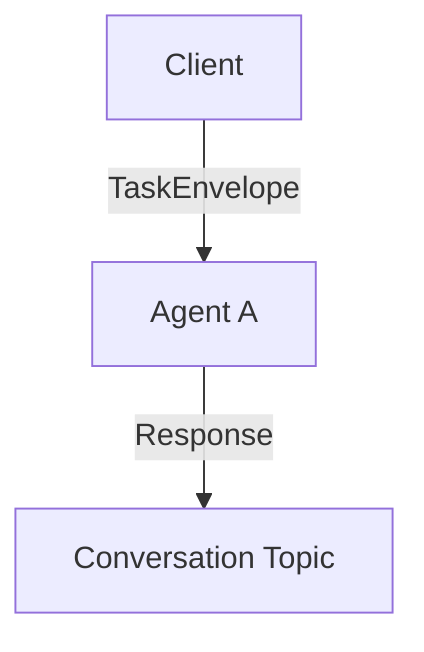
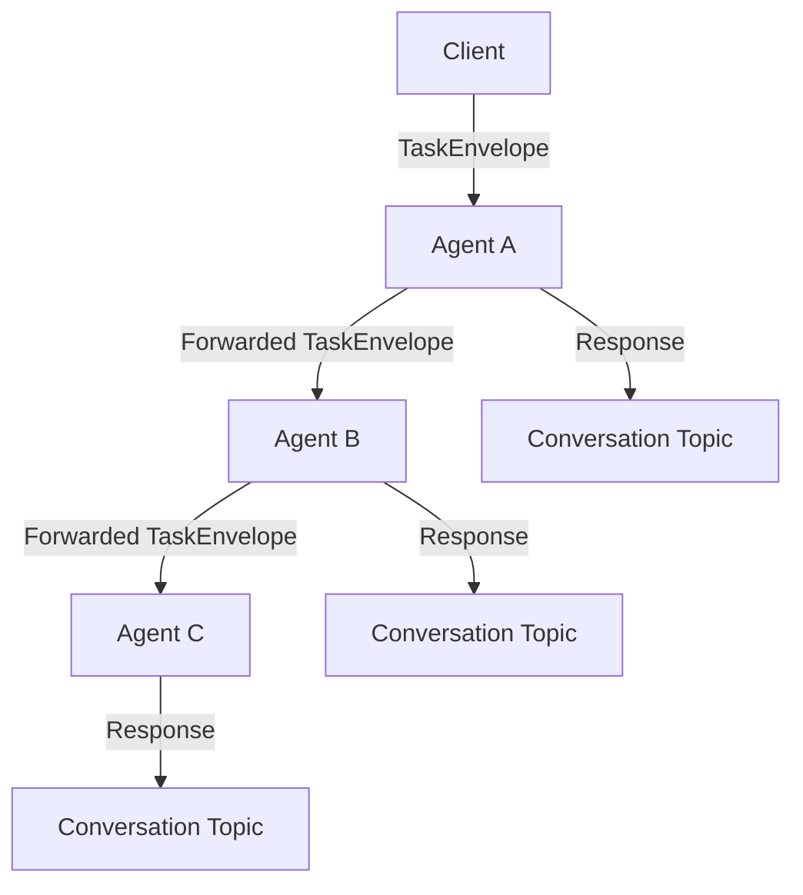

# TaskEnvelope Protocol: Nested Pipeline Architecture

## Overview

The 2389 Agent Protocol uses a nested TaskEnvelope structure to enable complex multi-agent pipelines. This document provides a comprehensive technical specification of the protocol's payload shape, message flow patterns, and pipeline depth management.

**Protocol Versions:**
- **v1.0**: Core protocol with static routing (production-ready)
- **v2.0**: Enhanced with dynamic routing and agent discovery (80% complete, in development)

This document covers both v1.0 (complete) and v2.0 (in development). See [DYNAMIC_ROUTING_ANALYSIS.md](../DYNAMIC_ROUTING_ANALYSIS.md) for v2.0 implementation status.

## Core Message Structure

### TaskEnvelope v1.0 Schema (Production)

```rust
#[derive(Debug, Clone, Serialize, Deserialize, PartialEq)]
pub struct TaskEnvelope {
    /// UUID v4 task identifier for idempotency
    pub task_id: Uuid,
    /// Conversation identifier for error routing
    pub conversation_id: String,
    /// MQTT topic (must be canonicalized)
    pub topic: String,
    /// Instruction for this agent (optional)
    pub instruction: Option<String>,
    /// Input data - SHOULD be object for structured data
    pub input: Value,
    /// Next agent in pipeline (optional)
    pub next: Option<Box<NextTask>>,
}
```

### TaskEnvelope v2.0 Schema (In Development)

```rust
#[derive(Debug, Clone, Serialize, Deserialize, PartialEq)]
pub struct TaskEnvelopeV2 {
    /// All v1.0 fields plus:
    pub task_id: Uuid,
    pub conversation_id: String,
    pub topic: String,
    pub instruction: Option<String>,
    pub input: Value,
    pub next: Option<Box<NextTask>>,
    /// Version identifier - "2.0"
    pub version: String,
    /// Dynamic routing configuration
    pub routing: Option<RoutingConfig>,
    /// Routing trace for observability
    pub routing_trace: Option<Vec<RoutingStep>>,
}

/// Routing configuration for v2.0
#[derive(Debug, Clone, Serialize, Deserialize, PartialEq)]
pub struct RoutingConfig {
    /// "static" or "dynamic"
    pub mode: String,
    /// Conditional routing rules
    pub rules: Option<Vec<RoutingRule>>,
    /// "static" or "drop" - fallback behavior
    pub fallback: Option<String>,
}

/// Conditional routing rule
#[derive(Debug, Clone, Serialize, Deserialize, PartialEq)]
pub struct RoutingRule {
    /// JSONPath condition to evaluate
    pub condition: String,
    /// Target agent ID if condition matches
    pub target_agent: String,
    /// Rule priority (lower = higher priority)
    pub priority: u32,
}
```

**Version Detection:**
The system automatically detects envelope versions:
```rust
#[serde(untagged)]
pub enum TaskEnvelopeWrapper {
    V2(TaskEnvelopeV2),  // Has "version" field
    V1(TaskEnvelope),    // No "version" field
}
```

### NextTask Schema

```rust
#[derive(Debug, Clone, Serialize, Deserialize, PartialEq)]
pub struct NextTask {
    /// Next agent topic or final destination
    pub topic: String,
    /// Instruction for next agent
    pub instruction: Option<String>,
    /// Input will be set to previous agent's output
    pub input: Option<Value>,
    /// Continuation of pipeline
    pub next: Option<Box<NextTask>>,
}
```

## Nested Pipeline Architecture

### Pipeline Depth Calculation

The protocol enforces a maximum pipeline depth of **16 agents** ([req: FR-013]) to prevent infinite loops and resource exhaustion:

```rust
fn calculate_pipeline_depth_pure(task: &TaskEnvelope) -> u32 {
    let mut depth = 1;
    let mut current = &task.next;

    while let Some(next) = current {
        depth += 1;
        current = &next.next;

        if depth > 1000 {  // Safety guard
            break;
        }
    }

    depth
}
```

### Pipeline Depth Examples

#### Simple Task (Depth: 1)
```json
{
  "task_id": "550e8400-e29b-41d4-a716-446655440000",
  "conversation_id": "conv-123",
  "topic": "/control/agents/agent-a/input",
  "instruction": "Process initial data",
  "input": {"data": "value"},
  "next": null
}
```

#### Linear Pipeline (Depth: 3)
```json
{
  "task_id": "550e8400-e29b-41d4-a716-446655440000",
  "conversation_id": "conv-123",
  "topic": "/control/agents/agent-a/input",
  "instruction": "Start processing",
  "input": {"data": "raw"},
  "next": {
    "topic": "/control/agents/agent-b/input",
    "instruction": "Transform data",
    "input": null,
    "next": {
      "topic": "/control/agents/agent-c/input",
      "instruction": "Finalize result",
      "input": null,
      "next": null
    }
  }
}
```

#### Maximum Depth Pipeline (Depth: 16)
```json
{
  "task_id": "550e8400-e29b-41d4-a716-446655440000",
  "conversation_id": "conv-123",
  "topic": "/control/agents/agent-1/input",
  "instruction": "Start pipeline",
  "input": {"initial": "data"},
  "next": {
    "topic": "/control/agents/agent-2/input",
    "instruction": "Step 2",
    "input": null,
    "next": {
      "topic": "/control/agents/agent-3/input",
      "instruction": "Step 3",
      "input": null,
      "next": {
        // ... continues through agent-16
        "topic": "/control/agents/agent-16/input",
        "instruction": "Final step",
        "input": null,
        "next": null
      }
    }
  }
}
```

## Message Flow Patterns

### 1. Single Agent Processing



**Message Flow:**
1. Client publishes TaskEnvelope to `/control/agents/agent-a/input`
2. Agent A processes task (9-step algorithm)
3. Agent A publishes response to `/conversations/{conv_id}/agent-a`

### 2. Linear Pipeline Processing



**Message Flow:**
1. Client publishes TaskEnvelope with `next` field to Agent A
2. Agent A processes, forwards to Agent B with modified envelope
3. Agent B processes, forwards to Agent C with modified envelope
4. Each agent publishes responses to their respective conversation topics

### 3. Pipeline Task Transformation

During forwarding, the TaskEnvelope is transformed:

**Original Task (Agent A receives):**
```json
{
  "task_id": "550e8400-e29b-41d4-a716-446655440000",
  "conversation_id": "conv-123",
  "topic": "/control/agents/agent-a/input",
  "instruction": "Extract data",
  "input": {"raw": "content"},
  "next": {
    "topic": "/control/agents/agent-b/input",
    "instruction": "Transform extracted data",
    "input": null,
    "next": null
  }
}
```

**Forwarded Task (Agent B receives):**
```json
{
  "task_id": "550e8400-e29b-41d4-a716-446655440000",
  "conversation_id": "conv-123",
  "topic": "/control/agents/agent-b/input",
  "instruction": "Transform extracted data",
  "input": "Agent A's response output",
  "next": null
}
```

**Key Transformation Rules:**
- `task_id` remains unchanged for traceability
- `conversation_id` remains unchanged for error routing
- `topic` becomes the next agent's topic
- `instruction` becomes next task's instruction
- `input` becomes previous agent's response (if next.input is null)
- `next` becomes next task's nested next field

## 9-Step Processing Algorithm

Each agent processes TaskEnvelopes using the exact 9-step algorithm:

### Step-by-Step Breakdown

```rust
// Step 1: Receive message on input topic
fn step_1_receive_message(received_topic: &str) -> ProcessingState

// Step 2: Check if message is retained (reject if true)
fn step_2_check_retained(is_retained: bool) -> ProcessingState

// Step 3: Validate topic canonicalization
fn step_3_validate_topic(received_topic: &str, task_topic: &str) -> ProcessingState

// Step 4: Check task idempotency (duplicate task_id detection)
async fn step_4_check_idempotency(&self, task_id: Uuid) -> ProcessingState

// Step 5: Check pipeline depth (max 16)
fn step_5_check_pipeline_depth(task: &TaskEnvelope, max_depth: u32) -> ProcessingState

// Step 6: Parse task envelope (validation via serde)
fn step_6_parse_envelope() -> ProcessingState

// Step 7: Process with LLM and tools
async fn step_7_process_with_llm(&self, task: &TaskEnvelope) -> ProcessingState

// Step 8: Forward to next agent if specified
async fn step_8_forward_if_needed(&self, task: &TaskEnvelope, response: &str) -> ProcessingState

// Step 9: Publish response to conversation topic
async fn step_9_publish_response(&self, task: &TaskEnvelope, response: &str) -> ProcessingState
```

## Error Handling and Protocol Compliance

### Pipeline Depth Validation

```rust
// Step 5 implementation
fn step_5_check_pipeline_depth(task: &TaskEnvelope, max_depth: u32) -> ProcessingState {
    let pipeline_depth = Self::calculate_pipeline_depth_pure(task);
    if pipeline_depth > max_depth {
        ProcessingState {
            step: 5,
            description: format!("Pipeline depth {} exceeds limit {}", pipeline_depth, max_depth),
            success: false,
            error_message: Some(format!("Pipeline depth {} exceeds maximum {}", pipeline_depth, max_depth)),
        }
    } else {
        ProcessingState {
            step: 5,
            description: format!("Pipeline depth {} within limit {}", pipeline_depth, max_depth),
            success: true,
            error_message: None,
        }
    }
}
```

### Error Publishing

When any step fails, errors are published to conversation topics:

```rust
let conversation_topic = format!("/conversations/{}/{}", task.conversation_id, agent_id);
// Publish error details to conversation_topic
```

### Idempotency Enforcement

```rust
// Step 4 maintains processed task cache
let mut processed = self.processed_tasks.lock().await;
if processed.contains(&task_id) {
    return ProcessingState {
        step: 4,
        description: format!("Duplicate task ID {} rejected for idempotency", task_id),
        success: false,
        error_message: Some("Task already processed (idempotency)".to_string()),
    };
}
```

## Topic Canonicalization

All topics undergo canonicalization before validation:

```rust
fn canonicalize_topic(topic: &str) -> String {
    // 1. Ensure single leading slash
    // 2. Remove trailing slashes
    // 3. Collapse multiple consecutive slashes
    // Example: "//control//agents/foo/" -> "/control/agents/foo"
}
```

## Configuration

### ProcessorConfig

```rust
#[derive(Debug, Clone)]
pub struct ProcessorConfig {
    /// Maximum pipeline depth per RFC FR-013
    pub max_pipeline_depth: u32,
    /// Maximum processed task IDs to keep in memory
    pub max_task_cache: usize,
}

impl Default for ProcessorConfig {
    fn default() -> Self {
        Self {
            max_pipeline_depth: 16, // RFC FR-013 requirement
            max_task_cache: 10000,
        }
    }
}
```

## Protocol Requirements Compliance

### Critical Requirements Satisfied

- **[req: FR-001]** - Interoperability through standardized JSON schema
- **[req: FR-002]** - Complete 8-step startup sequence (separate from 9-step processing)
- **[req: FR-003]** - Proper shutdown sequence with resource cleanup
- **[req: FR-014]** - Exact 9-step task processing algorithm implementation
- **[req: FR-013]** - Pipeline depth enforcement (max 16)
- **[req: FR-006]** - Topic canonicalization rules
- **[req: FR-010]** - Idempotency handling with task ID deduplication

### Message Flow Guarantees

1. **Idempotency**: Same task_id processed only once per agent
2. **Traceability**: task_id preserved throughout pipeline
3. **Error Isolation**: Failures don't cascade to other agents
4. **Resource Bounds**: Pipeline depth limited to prevent resource exhaustion
5. **Topic Validation**: All topics canonicalized before processing

## Advanced Use Cases

### Conditional Pipeline Branching

While not explicitly supported in the core protocol, conditional branching can be implemented by agents dynamically modifying the `next` field based on processing results:

```json
{
  "task_id": "550e8400-e29b-41d4-a716-446655440000",
  "conversation_id": "conv-123",
  "topic": "/control/agents/decision-agent/input",
  "instruction": "Route based on data type",
  "input": {"type": "image", "data": "..."},
  "next": {
    "topic": "/control/agents/image-processor/input",
    "instruction": "Process image data",
    "input": null,
    "next": null
  }
}
```

### Pipeline Recovery Patterns

Agents can implement error recovery by:
1. Publishing detailed error information to conversation topics
2. Implementing retry logic with exponential backoff
3. Using dead letter queues for failed pipeline segments
4. Monitoring pipeline health via conversation topic subscriptions

### Performance Characteristics

- **Latency**: Sub-100ms processing per agent for simple tasks
- **Throughput**: 1000+ messages/second per agent
- **Memory**: Bounded by max_task_cache configuration
- **Network**: QoS 1 MQTT with proper acknowledgments

## Implementation Notes

### Task ID Generation

```rust
use uuid::Uuid;
let task_id = Uuid::new_v4(); // Always use UUID v4
```

### Input Data Handling

- **Structured Data**: Use JSON objects for complex data
- **Simple Data**: String values acceptable for simple cases
- **Null Handling**: `input: null` is valid but discouraged
- **Size Limits**: Implementation-dependent (typically 1MB max)

### Topic Naming Conventions

```
/control/agents/{agent_id}/input     # Agent input topics
/conversations/{conv_id}/{agent_id}  # Response/error topics
/control/agents/{agent_id}/status    # Agent availability
```

This nested TaskEnvelope protocol enables sophisticated multi-agent workflows while maintaining strict protocol compliance, error isolation, and resource bounds.

---

## See Also

### Getting Started

- **[Getting Started Guide](GETTING_STARTED.md)** - Practical examples using this protocol
- **[CLI Tools Reference](CLI_TOOLS.md)** - Tools for creating and testing TaskEnvelopes
- **[Configuration Reference](CONFIGURATION_REFERENCE.md)** - Agent configuration for protocol compliance

### System Design

- **[Architecture Overview](ARCHITECTURE.md)** - How this protocol fits into the system architecture
- **[Agent Capabilities](AGENT_CAPABILITIES.md)** - Capability-based routing using TaskEnvelope metadata
- **[Testing Guide](TESTING.md)** - Protocol validation and compliance testing

### Operations

- **[Deployment Guide](DEPLOYMENT.md)** - Deploying protocol-compliant agents
- **[Troubleshooting Guide](TROUBLESHOOTING.md)** - Protocol-related issues and debugging
- **[Observability Guide](OBSERVABILITY.md)** - Monitoring protocol messages and flows