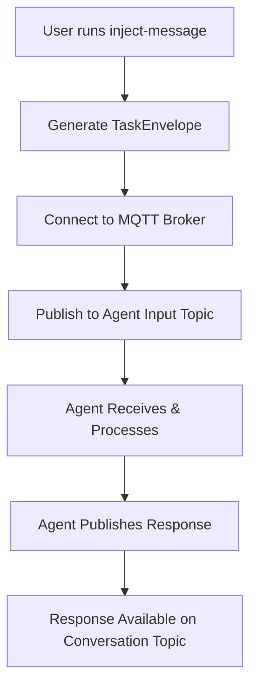

# Task Injector Tool: Quick Intro to V1 Envelope Handling

## Overview

The task injector (`inject-message`) is a standalone CLI tool for quickly sending test messages to running 2389 agents. It creates properly formatted v1 TaskEnvelopes and publishes them via MQTT, making it perfect for experimentation and testing agent behaviors.

## How It Works

### 1. V1 TaskEnvelope Structure

The injector creates v1 TaskEnvelopes with this structure:

```json
{
  "task_id": "550e8400-e29b-41d4-a716-446655440000",
  "conversation_id": "experiment-1234567890",
  "topic": "/control/agents/my-agent/input",
  "instruction": "Process this message: Hello world",
  "input": {
    "message": "Hello world",
    "tool_request": {
      "name": "http_request",
      "parameters": {"url": "https://api.example.com", "method": "GET"}
    }
  },
  "next": {
    "topic": "/control/agents/next-agent/input",
    "instruction": "Continue processing",
    "input": null,
    "next": null
  }
}
```

### 2. Message Flow



### 3. Core Components

#### Topic Canonicalization
The injector follows strict 2389 protocol rules for topic formatting:

```rust
fn canonicalize_topic(&self, topic: &str) -> String {
    // 1. Ensure single leading slash
    // 2. Remove trailing slashes
    // 3. Collapse consecutive slashes
    // "/control//agents/foo/" -> "/control/agents/foo"
}
```

#### TaskEnvelope Generation
Creates protocol-compliant envelopes with:
- **UUID v4 task_id** for idempotency
- **Auto-generated conversation_id** if not provided
- **Canonicalized topics** for both current and next agents
- **Structured input data** with message and optional tool requests
- **Pipeline support** via the `next` field

## Usage Examples

### Basic Message Injection
```bash
# Simple message to an agent
cargo run --bin inject-message -- \
  --agent-id research-agent \
  --message "Research the latest AI developments"
```

**Generated Envelope:**
```json
{
  "task_id": "uuid-v4-here",
  "conversation_id": "experiment-1234567890",
  "topic": "/control/agents/research-agent/input",
  "instruction": "Process this message: Research the latest AI developments",
  "input": {
    "message": "Research the latest AI developments"
  }
}
```

### Tool Execution Request
```bash
# Request agent to use a specific tool
cargo run --bin inject-message -- \
  --agent-id dev-agent \
  --message "Get current weather" \
  --tool http_request \
  --tool-params '{"url": "http://api.weather.com", "method": "GET"}'
```

**Generated Envelope:**
```json
{
  "task_id": "uuid-v4-here",
  "conversation_id": "experiment-1234567890",
  "topic": "/control/agents/dev-agent/input",
  "instruction": "Process this message: Get current weather",
  "input": {
    "message": "Get current weather",
    "tool_request": {
      "name": "http_request",
      "parameters": {
        "url": "http://api.weather.com",
        "method": "GET"
      }
    }
  }
}
```

### Pipeline Chain Creation
```bash
# Create a multi-agent pipeline
cargo run --bin inject-message -- \
  --agent-id research-agent \
  --message "Research AI trends then write article" \
  --next-agent writer-agent
```

**Generated Envelope:**
```json
{
  "task_id": "uuid-v4-here",
  "conversation_id": "experiment-1234567890",
  "topic": "/control/agents/research-agent/input",
  "instruction": "Process this message: Research AI trends then write article",
  "input": {
    "message": "Research AI trends then write article"
  },
  "next": {
    "topic": "/control/agents/writer-agent/input",
    "instruction": "Continue processing",
    "input": null,
    "next": null
  }
}
```

### Custom Conversation Tracking
```bash
# Use specific conversation ID for organized testing
cargo run --bin inject-message -- \
  --agent-id test-agent \
  --message "Start test sequence A" \
  --conversation-id "test-sequence-a"
```

## Key Features

### 1. **Protocol Compliance**
- ✅ Generates RFC-compliant v1 TaskEnvelopes
- ✅ Follows 2389 topic canonicalization rules
- ✅ Uses QoS 1 for reliable message delivery
- ✅ Proper UUID v4 generation for task IDs

### 2. **MQTT Integration**
- ✅ Automatic broker connection with keep-alive
- ✅ Background event loop handling
- ✅ Publishes to correct agent input topics: `/control/agents/{agent_id}/input`
- ✅ Non-retained messages (as per protocol)

### 3. **Developer Experience**
- ✅ Clean CLI interface with validation
- ✅ Auto-generated conversation IDs for quick testing
- ✅ JSON validation for tool parameters
- ✅ Helpful output showing where to monitor responses
- ✅ Error handling with clear messages

### 4. **Envelope Flexibility**
- ✅ Simple text messages
- ✅ Tool execution requests with parameters
- ✅ Agent pipeline chaining via `next` field
- ✅ Custom conversation tracking
- ✅ Structured input data with message + metadata

## Response Monitoring

After injection, agent responses appear on conversation topics:

```bash
# Responses published to:
/conversations/{conversation_id}/{agent_id}

# Example:
/conversations/experiment-1234567890/research-agent
```

**Typical Response Structure:**
```json
{
  "response": "I've researched the latest AI developments. Key findings include...",
  "task_id": "550e8400-e29b-41d4-a716-446655440000"
}
```

## Under the Hood

### Connection Process
1. **Client ID Generation**: `inject-message-{timestamp}` for uniqueness
2. **MQTT Options**: 60-second keep-alive, QoS 1 for reliability
3. **Event Loop**: Background task handles all MQTT events
4. **Connection Wait**: 1-second delay to ensure broker connection

### Envelope Creation Process
1. **Topic Canonicalization**: Apply 2389 protocol rules
2. **UUID Generation**: Create unique task_id using UUID v4
3. **Input Structuring**: Combine message + optional tool requests
4. **Pipeline Handling**: Add `next` field for multi-agent workflows
5. **JSON Serialization**: Pretty-printed for readability

### Error Handling
- **Connection Failures**: Clear error messages with broker details
- **JSON Validation**: Tool parameters validated before sending
- **Topic Validation**: Ensures proper canonicalization
- **Parameter Validation**: Prevents invalid tool param combinations

## Integration with Agent System

### Agent Processing Flow
1. **Injection**: Tool publishes TaskEnvelope to `/control/agents/{agent_id}/input`
2. **Reception**: Agent receives via MQTT subscription
3. **Validation**: Agent runs 9-step processing algorithm:
   - Topic validation
   - Idempotency check
   - Pipeline depth check
   - LLM processing
   - Tool execution
   - Response generation
4. **Publishing**: Agent publishes response to conversation topic
5. **Forwarding**: If `next` field present, forwards to next agent

### Pipeline Behavior
- **Task ID Preservation**: Same task_id throughout pipeline for traceability
- **Conversation Continuity**: All agents use same conversation_id
- **Response Aggregation**: Each agent publishes to their own conversation topic
- **Error Isolation**: Failures don't cascade across pipeline stages

## Best Practices

### For Testing
```bash
# Use descriptive conversation IDs
--conversation-id "feature-test-auth-flow"

# Test tool integration
--tool http_request --tool-params '{"url": "https://httpbin.org/json"}'

# Test pipeline chains
--next-agent processing-agent
```

### For Development
```bash
# Quick agent health check
--message "ping" --agent-id health-monitor

# Test specific capabilities
--message "Generate test report" --agent-id report-generator

# Experiment with complex pipelines
--message "Research -> Write -> Edit" --next-agent writer-agent
```

### For Debugging
```bash
# Use specific conversation IDs to isolate tests
--conversation-id "debug-session-$(date +%s)"

# Monitor multiple topics simultaneously
# /conversations/debug-session-1234567890/agent-name
```

## Limitations & Notes

### Current Limitations
- **No Response Monitoring**: Tool only injects, doesn't wait for responses
- **Single Message**: Each invocation sends one message only
- **No Pipeline Monitoring**: Can't track multi-agent pipeline progress
- **Basic Tool Support**: Simple parameter passing only

### Future Enhancements
- Real-time response monitoring
- Pipeline progress tracking
- Interactive conversation mode
- Message templates and presets
- Bulk message injection
- Response validation

The task injector provides a clean, reliable way to interact with 2389 agents during development and testing, ensuring all messages follow the v1 protocol specification exactly.