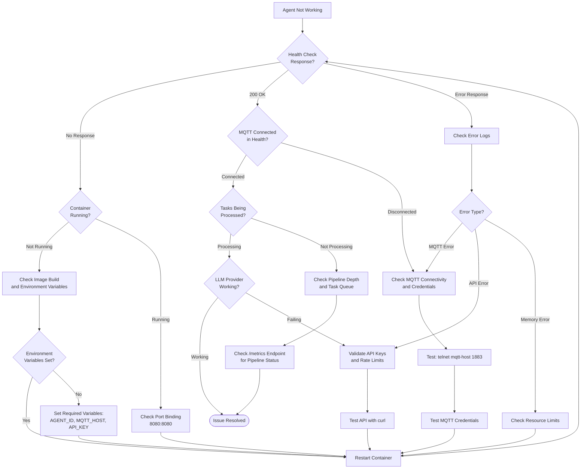

# Troubleshooting Guide

Complete guide for diagnosing and resolving common issues with the 2389 Agent Protocol Rust implementation.

## Table of Contents

- [Quick Diagnostics](#quick-diagnostics)
- [Connection Issues](#connection-issues)
- [Agent Startup Problems](#agent-startup-problems)
- [Task Processing Issues](#task-processing-issues)
- [Tool Execution Problems](#tool-execution-problems)
- [Performance Issues](#performance-issues)
- [Health Check Failures](#health-check-failures)
- [Logging and Observability Issues](#logging-and-observability-issues)
- [Container and Deployment Issues](#container-and-deployment-issues)
- [Diagnostic Commands](#diagnostic-commands)
- [Getting Help](#getting-help)

## Quick Diagnostics

### Troubleshooting Flowchart



### First Steps Checklist

When encountering issues, work through this checklist:

- [ ] **Check health endpoint**: `curl http://localhost:8080/health`
- [ ] **Verify agent is running**: `ps aux | grep agent2389` or `docker ps`
- [ ] **Review logs**: Check for ERROR or WARN messages
- [ ] **Test MQTT connectivity**: Use `telnet mqtt.example.com 1883`
- [ ] **Verify environment variables**: `echo $AGENT_ID $MQTT_HOST`
- [ ] **Check metrics**: `curl http://localhost:8080/metrics | jq`

## Connection Issues

### MQTT Connection Failed

**Symptom**: Agent fails to connect to MQTT broker

**Error Messages**:
```
ERROR: MQTT connection failed: Connection refused
ERROR: Failed to establish MQTT connection
WARN: Retrying MQTT connection (attempt 3/5)
```

**Diagnosis**:

```bash
# 1. Test basic connectivity
telnet mqtt.example.com 1883

# 2. Test MQTT connection with credentials
docker run --rm -it eclipse-mosquitto:2 mosquitto_pub \
  -h mqtt.example.com -t test -m "hello" \
  -u username -P password

# 3. Check firewall rules
sudo iptables -L | grep 1883
sudo iptables -L | grep 8883

# 4. Verify DNS resolution
nslookup mqtt.example.com
ping mqtt.example.com
```

**Solutions**:

1. **Connection Refused**
   - Verify MQTT broker is running: `docker ps | grep mosquitto`
   - Check broker port is open: `netstat -tlnp | grep 1883`
   - Verify firewall allows connections: `sudo ufw allow 1883`

2. **Authentication Failed**
   - Verify credentials are correct in configuration
   - Check environment variables are set: `echo $MQTT_USERNAME $MQTT_PASSWORD`
   - Test credentials manually with `mosquitto_pub`

3. **TLS Connection Issues**
   ```bash
   # For production with TLS (port 8883)
   mosquitto_pub \
     -h mqtt.example.com \
     -p 8883 \
     -u username \
     -P password \
     --capath /etc/ssl/certs \
     -t test \
     -m "TLS test"

   # For development with self-signed certs
   mosquitto_pub \
     -h mqtt.example.com \
     -p 8883 \
     -u username \
     -P password \
     --capath /etc/ssl/certs \
     --insecure \
     -t test \
     -m "TLS test"
   ```

4. **Network Connectivity**
   - Check routing: `traceroute mqtt.example.com`
   - Verify no proxy issues: `echo $HTTP_PROXY $HTTPS_PROXY`
   - Test from different network if possible

5. **Broker Configuration**
   ```conf
   # mosquitto.conf
   listener 1883 0.0.0.0
   allow_anonymous false
   password_file /mosquitto/config/passwd
   ```

### Cannot Subscribe to Topics

**Symptom**: Agent connects but doesn't receive messages

**Diagnosis**:

```bash
# 1. Monitor MQTT traffic
./scripts/mqtt-monitor.sh test-agent-rust

# 2. Check subscriptions in health endpoint
curl http://localhost:8080/health | jq '.checks.mqtt'

# 3. Test subscription manually
mosquitto_sub \
  -h mqtt.example.com \
  -p 1883 \
  -u username \
  -P password \
  -t '/control/agents/test-agent-rust/input' \
  -q 1 \
  -v
```

**Solutions**:

1. **Topic Permissions**
   - Verify ACL configuration allows subscriptions
   - Check broker logs for permission denials

2. **QoS Mismatch**
   - Ensure agent uses QoS 1 (default)
   - Verify broker supports QoS 1

3. **Topic Format**
   - Topics must start with `/`
   - No trailing slashes
   - Case sensitive

## Agent Startup Problems

### Agent Won't Start

**Symptom**: Agent exits immediately or fails to initialize

**Diagnosis**:

```bash
# 1. Build and check for errors
cargo build --release

# 2. Run with verbose output
RUST_LOG=debug cargo run -- --config config/agent.toml run

# 3. Check configuration validation
cargo run -- --config config/agent.toml validate
```

**Common Issues**:

1. **Invalid Configuration**
   ```
   Error: Invalid agent ID format: 'my agent with spaces'
   ```
   - Agent IDs must be alphanumeric with hyphens: `[a-zA-Z0-9._-]+`
   - No spaces or special characters

2. **Missing Environment Variables**
   ```
   Error: Environment variable not found: MQTT_USERNAME
   ```
   - Check all required variables are set
   - Verify `.env` file is loaded if using one

3. **MQTT URL Format**
   ```
   Error: Invalid MQTT broker URL: 'not-a-url'
   ```
   - Format: `mqtt://host:port` or `mqtts://host:port`
   - Examples: `mqtt://localhost:1883`, `mqtts://mqtt.example.com:8883`

4. **Port Already in Use**
   ```
   Error: Address already in use (os error 98)
   ```
   - Health check port 8080 is occupied
   - Change `HEALTH_PORT` environment variable
   - Kill process using port: `lsof -ti:8080 | xargs kill -9`

### Configuration Validation Errors

**Symptom**: Agent rejects configuration file

**Validation Errors**:

1. **Invalid Agent ID**
   ```toml
   # Bad
   id = "agent with spaces"
   id = "agent@home"
   id = ""

   # Good
   id = "agent-001"
   id = "my_agent.v2"
   ```

2. **Invalid MQTT Configuration**
   ```toml
   # Bad
   broker_url = "localhost:1883"  # Missing protocol
   broker_url = "mqtt://localhost"  # Missing port

   # Good
   broker_url = "mqtt://localhost:1883"
   broker_url = "mqtts://mqtt.example.com:8883"
   ```

3. **Missing Required Fields**
   ```toml
   [agent]
   id = "my-agent"
   # Missing: description (required)

   [llm]
   provider = "anthropic"
   # Missing: model, api_key_env, system_prompt
   ```

## Task Processing Issues

### Agent Not Responding to Tasks

**Symptom**: Tasks sent but no responses received

**Diagnosis**:

```bash
# 1. Verify agent is running
ps aux | grep agent2389

# 2. Monitor MQTT traffic
./scripts/mqtt-monitor.sh test-agent-rust

# 3. Check agent logs
docker logs agent2389 2>&1 | grep ERROR

# 4. Verify task format
echo "$TASK_JSON" | jq .
```

**Common Causes**:

1. **Invalid Task Format**
   - Task must be valid JSON
   - All required fields must be present
   ```json
   {
     "task_id": "required",
     "conversation_id": "required",
     "agent_id": "must-match-agent",
     "content": "required",
     "tools_available": [],
     "pipeline_depth": 1
   }
   ```

2. **Agent ID Mismatch**
   ```bash
   # Check agent ID in config
   grep "agent_id" config/agent.toml

   # Verify task targets correct agent
   echo "$TASK_JSON" | jq '.agent_id'
   ```

3. **Tool Not Available**
   ```bash
   # Check configured tools
   grep -A 5 "\[\[tools\]\]" config/agent.toml
   ```

4. **LLM API Issues**
   - Verify API key is set: `echo $OPENAI_API_KEY`
   - Test API connectivity (see LLM API Errors below)

### Tasks Timing Out

**Symptom**: Tasks start processing but never complete

**Diagnosis**:

```bash
# Check current pipeline depth
curl http://localhost:8080/metrics | jq '.tasks.current_pipeline_depth'

# Check processing times
curl http://localhost:8080/metrics | jq '.tasks | {avg, p95, p99}'

# Monitor active tasks
watch 'curl -s http://localhost:8080/metrics | jq .tasks.tasks_processing'
```

**Solutions**:

1. **Increase Task Timeout**
   ```toml
   # config/agent.toml
   task_timeout = 300  # 5 minutes (default: 60)
   ```

2. **Check LLM Response Time**
   - Monitor LLM API latency
   - Consider switching models or providers
   - Check for rate limiting

3. **Tool Execution Delays**
   ```toml
   [[tools]]
   name = "http_request"
   implementation = "builtin"

   [tools.config]
   timeout = 30  # Increase if needed
   ```

### Task Queue Backlog

**Symptom**: Tasks queue up without processing

**Diagnosis**:

```bash
# Check pipeline depth vs limits
curl http://localhost:8080/metrics | jq '{
  current: .tasks.current_pipeline_depth,
  max_reached: .tasks.max_pipeline_depth_reached,
  processing: .tasks.tasks_processing
}'
```

**Solutions**:

1. **Increase Pipeline Depth**
   ```toml
   max_pipeline_depth = 16  # Default: 8
   ```

2. **Scale Horizontally**
   - Deploy additional agent instances
   - Use unique agent IDs for each instance

3. **Optimize Processing**
   - Review system_prompt complexity
   - Reduce max_tokens if responses are too long
   - Simplify tool operations

## Tool Execution Problems

### Tool Not Found

**Symptom**: Error indicating tool doesn't exist

**Error Message**:
```
Error: Unknown tool: 'nonexistent_tool'
```

**Solutions**:

1. **Check Tool Configuration**
   ```bash
   # List configured tools
   grep -A 3 "\[\[tools\]\]" config/agent.toml
   ```

2. **Add Missing Tool**
   ```toml
   [[tools]]
   name = "http_request"
   implementation = "builtin"
   ```

3. **Verify Tool Name**
   - Tool names are case-sensitive
   - Must match exactly: `echo`, not `Echo`

### Tool Execution Failed

**Symptom**: Tool runs but returns error

**Diagnosis**:

```bash
# Check tool statistics
curl http://localhost:8080/metrics | jq '.tools.tool_stats'

# Monitor tool execution in logs
docker logs agent2389 2>&1 | grep "tool_execution"
```

**Common Issues**:

1. **File Operations - Permission Denied**
   ```toml
   [[tools]]
   name = "file_write"
   implementation = "builtin"

   [tools.config]
   max_file_size = 10485760
   allowed_paths = ["/tmp", "/data/workspace"]  # Must be writable
   ```

2. **HTTP Request - Connection Failed**
   ```bash
   # Test connectivity manually
   curl -v https://api.example.com

   # Check proxy settings
   echo $HTTP_PROXY $HTTPS_PROXY
   ```

3. **File Size Limits**
   ```toml
   [tools.config]
   max_file_size = 10485760  # 10MB - increase if needed
   ```

## Performance Issues

### High Memory Usage

**Symptom**: Memory usage grows over time

**Diagnosis**:

```bash
# Monitor memory usage
ps aux | grep agent2389

# Check container memory
docker stats agent2389

# Check pipeline depth
curl http://localhost:8080/metrics | jq '.tasks.current_pipeline_depth'
```

**Solutions**:

1. **Adjust Pipeline Depth**
   ```toml
   max_pipeline_depth = 4  # Reduce if memory constrained
   ```

2. **Container Memory Limits**
   ```yaml
   # docker-compose.yml
   services:
     agent2389:
       image: agent2389:latest
       deploy:
         resources:
           limits:
             memory: 1G
           reservations:
             memory: 512M
   ```

3. **Monitor for Memory Leaks**
   ```bash
   # Track memory over time
   while true; do
     echo "$(date): $(ps -o rss= -p $(pgrep agent2389))"
     sleep 60
   done
   ```

### High CPU Usage

**Symptom**: CPU utilization consistently high

**Diagnosis**:

```bash
# Check CPU usage
top -p $(pgrep agent2389)

# Check processing times
curl http://localhost:8080/metrics | jq '.tasks.avg_processing_time_ms'

# Enable span timing
LOG_SPANS=true cargo run -- run
```

**Solutions**:

1. **Reduce Log Level**
   ```bash
   # Production: INFO level
   LOG_LEVEL=INFO

   # Avoid: DEBUG or TRACE in production
   ```

2. **Disable Span Events**
   ```bash
   LOG_SPANS=false  # Disable in production
   ```

3. **Optimize System Prompt**
   - Simplify system prompt
   - Reduce max_tokens
   - Use faster LLM models (e.g., gpt-4o-mini)

### Slow Response Times

**Symptom**: Tasks take too long to complete

**Diagnosis**:

```bash
# Check percentile processing times
curl http://localhost:8080/metrics | jq '{
  avg: .tasks.avg_processing_time_ms,
  p50: .tasks.processing_time_p50_ms,
  p95: .tasks.processing_time_p95_ms,
  p99: .tasks.processing_time_p99_ms
}'

# Check tool execution times
curl http://localhost:8080/metrics | jq '.tools.tool_stats'

# Monitor LLM API latency
time curl https://api.openai.com/v1/models
```

**Solutions**:

1. **Network Latency**
   ```bash
   # Test MQTT broker latency
   ping mqtt.example.com

   # Test LLM API latency
   curl -w "@curl-format.txt" -s -o /dev/null https://api.openai.com/
   ```

2. **LLM Configuration**
   ```toml
   [llm]
   temperature = 0.7
   max_tokens = 2000  # Reduce if responses are too long
   ```

3. **Tool Timeouts**
   ```toml
   [tools.config]
   timeout = 30  # Adjust per tool requirements
   ```

## Health Check Failures

### Health Endpoint Returns 503

**Symptom**: `/health` endpoint returns Service Unavailable

**Diagnosis**:

```bash
# Check detailed health status
curl http://localhost:8080/health | jq '.checks'

# Verify individual components
curl http://localhost:8080/health | jq '.checks.mqtt.status'
curl http://localhost:8080/health | jq '.checks.task_processing.status'
```

**Solutions**:

1. **MQTT Not Connected**
   - Verify MQTT connection (see Connection Issues)
   - Check `set_mqtt_connected(true)` is called after connection

2. **Task Processing Stale**
   ```json
   {
     "status": "stale",
     "message": "No task activity for 450 seconds"
   }
   ```
   - This is normal if no tasks received
   - Health check requires task within last 5 minutes

3. **Health Server Not Started**
   ```bash
   # Verify health server is listening
   netstat -tlnp | grep :8080

   # Check HEALTH_PORT environment variable
   echo $HEALTH_PORT
   ```

### Kubernetes Probes Failing

**Symptom**: Pods failing readiness/liveness checks

**Diagnosis**:

```bash
# Check pod status
kubectl describe pod <pod-name>

# Test probes manually
kubectl exec <pod-name> -- curl -f http://localhost:8080/live
kubectl exec <pod-name> -- curl -f http://localhost:8080/ready
```

**Solutions**:

1. **Adjust Probe Timing**
   ```yaml
   livenessProbe:
     initialDelaySeconds: 30  # Increase for slow startup
     periodSeconds: 30
     timeoutSeconds: 10  # Increase if responses are slow
     failureThreshold: 3
   ```

2. **Verify Health Port**
   ```yaml
   env:
   - name: HEALTH_PORT
     value: "8080"

   ports:
   - containerPort: 8080
     name: health
   ```

3. **Check MQTT Dependency**
   - Readiness probe requires MQTT connection
   - Ensure MQTT broker is accessible from pod

## Logging and Observability Issues

### Logs Not Appearing

**Symptom**: No log output or missing log messages

**Diagnosis**:

```bash
# Check log initialization
RUST_LOG=trace ./agent2389 run 2>&1 | grep "tracing_subscriber"

# Verify log level
echo $LOG_LEVEL
echo $RUST_LOG
```

**Solutions**:

1. **Initialize Logging**
   - Ensure `init_logging()` or `init_default_logging()` is called in main()
   - Must be called before any logging statements

2. **Check Log Level**
   ```bash
   # Set appropriate log level
   export LOG_LEVEL=INFO  # ERROR, WARN, INFO, DEBUG, TRACE
   ```

3. **Verify RUST_LOG Filter**
   ```bash
   # Show only agent logs at debug level
   export RUST_LOG="agent2389=debug,warn"
   ```

### JSON Logs Malformed

**Symptom**: Invalid JSON in log output

**Diagnosis**:

```bash
# Test JSON validity
./agent2389 run 2>&1 | head -10 | jq .
```

**Solutions**:

1. **Use Correct Format**
   ```bash
   export LOG_FORMAT=json  # Not "JSON"
   ```

2. **Avoid stdout Pollution**
   - Don't use `println!` in production code
   - Use `tracing::info!` instead

3. **Check for Binary Data**
   - Ensure all logged data is UTF-8
   - Avoid logging raw bytes

### Metrics Not Updating

**Symptom**: Metrics counters remain at zero

**Diagnosis**:

```bash
# Check metrics endpoint
curl http://localhost:8080/metrics | jq '.tasks.tasks_received'

# Verify metrics are being recorded
docker logs agent2389 2>&1 | grep "metrics"
```

**Solutions**:

1. **Verify Metrics Calls**
   ```rust
   use agent2389::observability::metrics;

   let collector = metrics();
   collector.task_received();  // Ensure this is called
   ```

2. **Check for Early Returns**
   - Metrics might not be recorded if code returns early
   - Place metrics calls before error returns

3. **Confirm Global Collector**
   - Always use `metrics()` function
   - Don't create new MetricsCollector instances

## Container and Deployment Issues

### Container Won't Start

**Symptom**: Docker container exits immediately

**Diagnosis**:

```bash
# Check container logs
docker logs agent2389

# Inspect container
docker inspect agent2389

# Check image build
docker build -t agent2389:latest . --no-cache
```

**Solutions**:

1. **Missing Environment Variables**
   ```bash
   # Check required variables
   docker run --rm agent2389:latest env | grep -E "AGENT_ID|MQTT|API_KEY"
   ```

2. **Verify Dockerfile**
   ```dockerfile
   # Ensure USER is set correctly
   USER agent  # Must have required permissions

   # Verify CMD
   CMD ["agent2389", "run"]  # Correct binary name and command
   ```

3. **Check Base Image**
   ```dockerfile
   FROM debian:bookworm-slim
   # Ensure required libraries are installed
   RUN apt-get update && apt-get install -y ca-certificates
   ```

### Docker Networking Issues

**Symptom**: Container can't connect to external services

**Diagnosis**:

```bash
# Test from within container
docker exec agent2389 ping mqtt.example.com
docker exec agent2389 curl https://api.openai.com/

# Check Docker network
docker network inspect bridge
```

**Solutions**:

1. **Use Host Networking (Development)**
   ```bash
   docker run --network host agent2389:latest
   ```

2. **Configure DNS**
   ```yaml
   # docker-compose.yml
   services:
     agent2389:
       dns:
         - 8.8.8.8
         - 8.8.4.4
   ```

3. **Bridge to Host**
   ```yaml
   # Access services on host machine
   environment:
     - MQTT_HOST=host.docker.internal
   ```

## Diagnostic Commands

### Log Analysis

```bash
# Filter error logs only
docker logs agent2389 2>&1 | jq 'select(.level=="ERROR")'

# Task processing logs
docker logs agent2389 2>&1 | jq 'select(.span.name=="task_processing")'

# MQTT operation logs
docker logs agent2389 2>&1 | jq 'select(.target | contains("mqtt"))'

# Performance timing logs
docker logs agent2389 2>&1 | jq 'select(.fields.time)'

# Recent errors with context
docker logs agent2389 --tail 100 2>&1 | grep -i -A 5 -B 5 "error\|fail"
```

### Metrics Monitoring

```bash
# Watch key metrics
watch 'curl -s http://localhost:8080/metrics | \
  jq "{tasks_processing: .tasks.tasks_processing, mqtt_connected: .mqtt.connected, avg_time: .tasks.avg_processing_time_ms}"'

# Check tool performance
curl -s http://localhost:8080/metrics | \
  jq '.tools.tool_stats | to_entries | map({name: .key, success_rate: .value.success_rate, avg_time: .value.avg_execution_time_ms})'

# Monitor MQTT health
curl -s http://localhost:8080/metrics | \
  jq '.mqtt | {connected, messages_published, messages_received, connection_failures}'

# Track task throughput
curl -s http://localhost:8080/metrics | \
  jq '{received: .tasks.tasks_received, completed: .tasks.tasks_completed, failed: .tasks.tasks_failed, success_rate: ((.tasks.tasks_completed / .tasks.tasks_received) * 100)}'
```

### Health Status Monitoring

```bash
# Continuous health monitoring
while true; do
  echo "$(date): $(curl -s http://localhost:8080/health | jq -r '.status')"
  sleep 30
done

# Check readiness for K8s deployment
curl -f http://localhost:8080/ready && echo "Ready" || echo "Not Ready"

# Detailed health analysis
curl -s http://localhost:8080/health | \
  jq '.checks | to_entries | map({check: .key, status: .value.status, message: .value.message})'
```

### Network Diagnostics

```bash
# Test MQTT connectivity
telnet mqtt.example.com 1883

# Test MQTT with credentials
mosquitto_pub \
  -h mqtt.example.com \
  -p 1883 \
  -u username \
  -P password \
  -t test \
  -m "connection test"

# Check DNS resolution
nslookup mqtt.example.com
dig mqtt.example.com

# Test latency
ping -c 10 mqtt.example.com

# Trace route
traceroute mqtt.example.com

# Check firewall rules
sudo iptables -L -n | grep -E "1883|8883|8080"
```

### API Validation

```bash
# Test OpenAI API
curl -H "Authorization: Bearer $OPENAI_API_KEY" \
  -H "Content-Type: application/json" \
  https://api.openai.com/v1/models

# Test Anthropic API
curl -H "x-api-key: $ANTHROPIC_API_KEY" \
  -H "Content-Type: application/json" \
  -H "anthropic-version: 2023-06-01" \
  https://api.anthropic.com/v1/messages \
  -d '{"model":"claude-3-haiku-20240307","max_tokens":10,"messages":[{"role":"user","content":"test"}]}'

# Check for rate limiting
docker logs agent2389 2>&1 | grep -E "(rate limit|429|quota)"
```

## Getting Help

### Before Asking for Help

Collect this information:

1. **System Information**
   ```bash
   uname -a
   cargo --version
   docker --version
   ```

2. **Configuration**
   ```bash
   # Sanitized config (remove secrets)
   grep -v "password\|api_key" config/agent.toml
   ```

3. **Recent Logs**
   ```bash
   docker logs agent2389 --tail 100 > agent-logs.txt
   ```

4. **Metrics Snapshot**
   ```bash
   curl http://localhost:8080/metrics > metrics.json
   ```

5. **Health Status**
   ```bash
   curl http://localhost:8080/health > health.json
   ```

### Where to Get Help

1. **Documentation**
   - [Configuration Reference](CONFIGURATION_REFERENCE.md)
   - [Getting Started Guide](GETTING_STARTED.md)
   - [Architecture Overview](ARCHITECTURE.md)

2. **GitHub Issues**
   - Search existing issues
   - Include collected information above
   - Provide minimal reproduction steps

3. **Community**
   - Check project discussions
   - Ask in community channels

### Creating Good Bug Reports

Include:

1. **Clear description** of the problem
2. **Steps to reproduce** the issue
3. **Expected behavior** vs actual behavior
4. **Environment details** (OS, versions, etc.)
5. **Relevant logs and metrics**
6. **Configuration** (sanitized)

### Emergency Procedures

For production issues:

1. **Immediate Actions**
   - Check health endpoint
   - Review recent logs for errors
   - Verify MQTT connectivity
   - Check LLM API status

2. **Quick Recovery**
   - Restart agent: `docker restart agent2389`
   - Clear task queue if needed
   - Scale horizontally if overloaded

3. **Escalation**
   - Collect diagnostic information
   - Contact support with details
   - Implement workarounds if available

---

## See Also

### Essential Guides

- **[Getting Started Guide](GETTING_STARTED.md)** - Initial setup and configuration
- **[Configuration Reference](CONFIGURATION_REFERENCE.md)** - All configuration options and validation
- **[CLI Tools Reference](CLI_TOOLS.md)** - mqtt-monitor and other diagnostic tools

### Operations

- **[Deployment Guide](DEPLOYMENT.md)** - Production deployment and container management
- **[Observability Guide](OBSERVABILITY.md)** - Monitoring, metrics, and health checks
- **[Testing Guide](TESTING.md)** - Test procedures and validation

### Technical Details

- **[Architecture Overview](ARCHITECTURE.md)** - System design and component interactions
- **[TaskEnvelope Protocol](TASKENVELOPE_PROTOCOL.md)** - Protocol specification and message formats
- **[Agent Capabilities](AGENT_CAPABILITIES.md)** - Capability system behavior

---

This guide covers the most common issues encountered with the 2389 Agent Protocol. For issues not covered here, consult the other documentation or create a GitHub issue with detailed information.